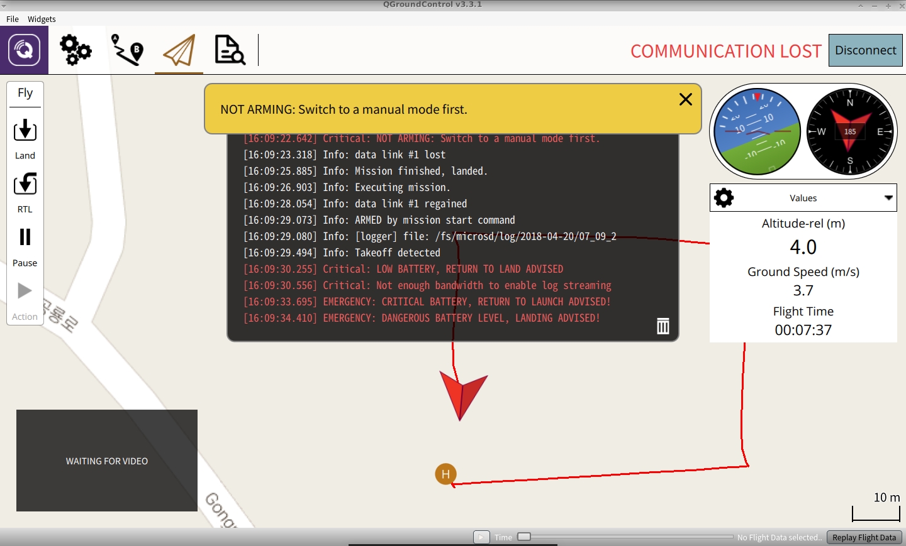

<[비거니즘 전시 매뉴얼](https://0makes0.com/pdf/%EB%B9%84%EA%B1%B0%EB%8B%88%EC%A6%98_%EC%A0%84%EC%8B%9C_%EB%A7%A4%EB%89%B4%EC%96%BC_ver1.pdf)>은 하나의 전시를 열고 닫기까지, 우리가 당연하게 생각해온 전시의 프로세스를 돌아보며, 전시를 만들고 해체하는 전 과정에서 마주하는 여러 결정의 순간에 보다 환경에 덜 빚지는 선택지를 제공하기 위한 매뉴얼입니다. 비거니즘의 의미를 채식, 인간중심의 종차별적인 활동 너머로 확장하기를 제안합니다. 비거니즘 전시 매뉴얼 ver.1 (2021)은 김화용, 남선우, 박태인, 여혜진, 이규동, 이목화가 한 팀이 되어 진행한 제로의 예술 내부 워크숍의 결과물로, 이번 페스티벌에서 ver.1을 위키 버전으로 공개하고, 시민들과 함께 ver.2를 만듭니다. 

사이트를 방문해주신 분들은 누구든지 비거니즘 전시 매뉴얼 위키를 수정/추가할 수 있습니다.

이 사이트는 태양열 서버 ~~~ 뫄뫄뫄뫄~~~~~~~ 탄소발자국 데이터 센터~~~~~ 뫄뫄뫄~~~~~인터넷 적당히 해라~~~~~

+ 위키 수정/추가 방법 소개

| Command | Description |
| --- | --- |
| git status | List all new or modified files |
| git diff | Show file differences that haven't been staged |

* https://wiki.0makes0.com/docx/book.docx 워드 버전 
* https://wiki.0makes0.com/epub/book.epub 전자책 epub 버전 
* https://wiki.0makes0.com/pdf/book.pdf pdf 버전 
 
 