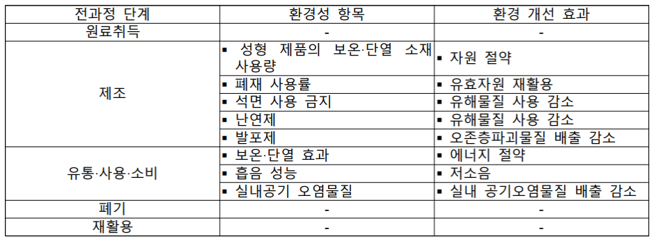

전시장의 불이 꺼지면 하나의 전시를 구성하는 수많은 부품들은 어디로 사라질까. 이 장에서는 전시가 해체되는 시점 역시 고려되길 권유한다. 전시의 시작점에서 모든 과정이 끝나고 버려지는 순간까지 생각한다면 우리는 무엇을 더하고 뺄 수 있을까? 

그러나 폐기의 과정은 전시라는 한정적인 영역에서 출발하였음에도 그에 관한 명확한 사실을 찾아내기 어려웠다. 배출되는 폐기물의 구성물질, 양, 배출되는 지역등의 요소, 담당 업체에 따라서 결과는 천차만별이다. 또한 한국은 폐기-재활용으로 이어지는 소위 자원의 순환 과정에서 높은 재활용률을 자랑하지만, 이는 소각, 화학적 처리 등을 통해 에너지나 연료를 얻는 방식의 재활용을 포함하기 때문이다. 폐기물을 곧장 매립하는 것보다 자원을 재활용하는 측면에서 환경적일지 모르나, 그것이 발생시키는 또 다른 오염원을 고려한다면 완전히 친환경적인 해결책이라 볼 수 없다. 따라서 폐기와 재활용 역시 개개인의 실천을 넘어선 시스템의 구축이 필요하다. 본문에서는 폐기와 재활용에 대한 용어를 정리하고 간략한 로드맵을 제시한다. 보다 확장될 다음의 매뉴얼에서는 개인의 영역을 벗어나 적극적이고 실천 가능한 폐기의 방법을 고민할 수 있길 희망한다.

##폐기물

###폐기물 종류

* 폐기물의 정의 
쓰레기, 연소재, 오니 , 폐유, 폐산, 폐알칼리 및 동물의 사체 등으로서 사람의 생활이나 사업활동에 필요없게 된 물질. 폐기물관리법에 따라 '생활폐기물'과 '사업장폐기물'로 분류된다.

* 쓰레기와 폐기물
쓰레기(Garbage)와 폐기물(Waste)은 모두 ‘더럽고 쓸모없는 물질’이다. ‘폐기물’ 은 좀 더 공식적인 행정용어로 쓰이며, ‘쓰레기’는 ‘쓸다’의 명사형 ‘쓸어기’에서 나온 말로 ‘못 쓰게 된 조각’을 의미한다. 쓰레기는 생명이 없는 무생물 물질을 뜻하며, ‘폐기물 관리법에 적용되는 물질’일 때 쓰레기로 분류된다.

* 생활 폐기물 
생활폐기물은 사업장폐기물 외의 폐기물을 뜻한다.

* 사업장폐기물
사업장의 산업 활동으로 생긴 폐기물을 뜻한다. 대기 환경 보전법, 수질 환경 보건법, 소음 진동 규제법의 규정에 의하여 배출 시설을 설치하고 운영하는 사업장, 그 외에 지정 폐기물을 배출하는 사업장, 폐기물을 하루 평균 300kg 이상 배출하는 사업장에서 발생하는 폐기물을 가리킨다. 

 

2. 폐기물 처리 과정

‘폐기물 처리’란 오염물질인 폐기물로 인한 환경오염을 막으면서 자원으로 이용 가능한 것을 분리해내고, 정해진 구역에 보관, 정해진 시설로 운반한 후 처분하거나 재활용을 하는 것을 말한다. 폐기물 관리법에 의해 폐기물 수집, 운반, 보관, 재활용, 처분의 과정을 거친다.   
생활폐기물은 공공의 영역에서 관리하지만, 그 외 재활용 폐기물은 사설 업체와 계약을 맺어 처리하고 있다. 현재 폐기물 처리의 고유권한은 구청장에게 있기 때문에 같은 지역 내에서 폐기물을 버리더라도 구마다 분리배출 방법이 다르게 적용되고 있다. 재활용의 과정은 자원 순환을 위해 움직이지 않는다. 슬프게도 자본의 기준에 따라 움직이게 되는데 처리하는 과정에서 지불해야 하는 비용(운송비, 물류비, 인건비 등)이 매각비용보다 더 낮을 경우 재활용이 되고 있는 실정이다. 다시 말해 원론적으로 재활용이 가능하더라도 지역에서 소화할 수 있는 처리 시설이 없다거나 그 당시의 품목별 처리 단가, 적재된 폐기물의 양에 따라 재활용이 되지 않을 수도 있다. 재활용이 되지 않는 대부분의 쓰레기는 소각되거나 매립된다. 소각이나 매립의 방식으로라도 처리가 되면 다행이지만 제대로 처리하지 않고 버리고 간 쓰레기들은 각종 환경 문제와 사회 문제를 유발시키고 있다. 

 a. 재사용
 
‘재사용’이란, 특별한 처리 과정 없이 공병이나 헌옷 등과 같이 제품의 원래 사용 목적과 같은 목적으로 사용하는 것을 뜻한다.

 b. 재활용 
 
 ‘재활용’이란, 어떤 목적에 사용된 재료나 원료가 목적대로 쓰이고 난 후 아직도 쓸모가 있거나 재생할 수 있는 것을 모두 다시 사용하는 것을 말한다. 재활용이 잘 되기 위해서는 오염되지 않은 깨끗한 상태일 때, 다른 혼합물이 섞이지 않은 원자재로 유지돼야 한다.
 
 
 
 재활용은 다시 물리적, 화학적 방법에 의한 ‘물질회수’와 주로 소각 혹은 열 분해에 의한 ‘에너지 회수’로 구별된다. 일반적으로 재활용은 부산물이나 폐기물을 자원으로써 다시 활용하는 것이라고 할 수 있다. 가연성 폐기물을 열적 처리하여 에너지를 얻는 ‘에너지 회수’ 방식의 고형연료(Solid Refuse Fue, SRF) 열병합발전소 모두 포함하는 의미 로서 자원을 사회시스템의 순환체계에 끼어 넣을 수 있는 형태로 순환 사용하는 의미로 사용하고 있다.  에너지 회수로 재활용 될 때 소각을 통한 화학 처리 과정 혹은 기타 다른 처리 방식에서 발생하는 탄소와 에너지의 사용, 소각 및 화학 부산물 등이 발생하게 된다. 

 c. 소각
 
 ‘소각처리’라고도 한다. 폐기물 관리체계 중 중간처리 과정의 하나이며 화학적 방법에 속한다. 대기 및 토양오염 원인물질이 생기므로 철저한 오염방지 시설을 갖추어야 하는 어려움이 따른다.
 
 d. 매립

쓰레기의 최종 처분 방법이다. 무기성 폐기물을 포함한 잔류물, 소각재 등을 매립지에 매립하는 방법이다. 가장 쉽고, 비용이 적게 소모되지만 환경에 막대한 영향을 끼칠 수 있다. 캔버스, 고무재질 폴리염화비닐(PVC), 시트지, 현수막 등 재활용되지 않고 매립된다. 

3. 폐기를 위한 로드맵

그렇다면, 전시장에서 여러 폐기물을 배출할때 이 폐기물이 재활용 될 수 있도록 하는 방법은 무엇일까? 아래는 전시장에서 나올 법한 폐기물들을 품목별로 크게 도식화하여 최대한 폐기 이후에 재활용이 가능한 형태로 폐기하는 방법을 제안했다. 그러나 이것 역시 폐기물이 재활용되기 위한 가장 일반적인 방식이며, 정확한 것은 해당 지역의 지자체에 문의할 필요가 있다.

## B. 재료별 내재에너지 비교

재료별 내재에너지를 정리한 표는 다음과 같다. 국내에는 내재에너지를 추적한 데이터베이스가 없는 관계로, 호주와 영국의 연구결과를 인용하여 정리하였다. 국가 별 제조산업의 규모나 지리학적 특성에 따라 내재에너지 값은 달라질 수 있으므로, 절대적인 수치를 참고하기보다는 재료들 간의 상대적인 비교를 위한 용도로 참고할 수 있을 것이다.  재료 간의 비교로써 다음의 표를 이용하기 위해서는 각 재료의 밀도를 적용하여 표의 내재에너지(MJ/kg)를 부피(MJ/m³)나 시공면적(MJ/m²)으로 환산하여 실제적인 대체효과를 고려해봐야 한다.

| 재료 |  | 내재 에너지(MJ/kg) |  |  |
| ---- | ------- | ------ | ---- | ---- |
| 분류 | 명칭 | Lawson 1996, 호주 | Bath 대학 2008, 영국 | Melbourne 대학 2019, 호주 |
| 고무 | 천연고무 |  |  | 75.2 |
| 고무 | 합성고무 | 110 |  | 92.8  |
| 금속 | 알루미늄 바 |  |  | 345 |
| 금속 | 압출 성형 알루미늄 |  |  | 358 |
| 금속 | 알루미늄 | 170 |  | 295 |
| 금속 | 구리 | 100 |  |  226 | 
| 금속 | 구리파이프 |  |  | 150 |
| 금속 | 구리선 |  |  | 671 |
| 금속 | 함석(아연도금강철) | 38 | 39 | 43 |
| 금속 | 강철 | 35 | 35.3 | 43 |
| 금속 | 강철(재활용) | 9.8 | 9.5 |  |
| 금속 | 강철 평균 |  |  24.4 |  |
| 금속 | 강철 바 |  | 24.6 |  29.5 |
| 금속 | 강철 각관 |  |  | 54.8 |
| 금속 | 강철 파이프 |  |  | 42.9 |
| 금속 | 강철 골판 |  |  | 79.6 | 
| 금속 | 철사 |  | 36 |  |
| 금속 | 스테인레스 |  | 56.7 | 123 |
| 목재 | 원목 일반 |  | 8.5 | |
| 목재 | 소프트우드(자연건조) |  |  | 18.5 |
| 목재 | 하드우드 각재(기계건조) | 2 |7.8 | 27 |
| 목재 | 하드우드 각재(자연건조) | 0.5 | | |
| 목재 | 하드보드 | 24.2 | 16 | |
| 목재 | 파티클보드(PB) | 8 | 9.5 | 19 |
| 목재 | MDF | 11.3 | 11 | 22 |
| 목재 | 합판 | 10.4 | 15 | 43 |
| 목재 | 합판(내부용) |  |  | 101 |
| 목재 | 글루램 목재 | 11 | 12 | 67.5 |
| 목재 | CLT 목재(Cross Laminated Timber) | | | 20 |
| 목재 | LVL 목재(Laminated Veneer Lumber) | 11 |  | 34 | 
| 목재 | OSB 목재 | | | 24 |
| 목재 | 베니어 파티클보드 | | 23 | |
| 벽돌 | 흙벽돌 | 2.5 | 3 | 3.5 |
| 석고/시멘트 | 석고 | 2.9 | | 6.5 |
| 석고/시멘트 | 석고보드 | 4.4 | | 15.2 |
| 석고/시멘트 | 시멘트 | 5.6 | 4.6 | 11.8 |
| 석고/시멘트 | 몰탈(1:3) |  | 1.4 | 3.9 |
| 석고/시멘트 | 콘크리트 일반(1:2:4) | | 0.95 | |
| 석고/시멘트 | 콘크리트 블록 | 1.5 |  | 2.6 |
| 유리 | 유리 | 12.7 | 15 | 28.5 |
| 유리 | 강화유리 | | 23.5 | 29.8 |
| 유리 | 접합유리 | | | 36.4 |
| 페인트 | 수성페인트 | | | 8.7 |
| 페인트 | 유성페인트 | 61.5 | | 124 |
| 플라스틱 | 플라스틱 일반 | 90 | | |
| 플라스틱 | HDPE 필름 | | | 147 |
| 플라스틱 | HDPE 파이프 | | | 135 |
| 플라스틱 | LDPE 필름 | | | 136 |
| 플라스틱 | LDPE 파이프 | | | 130 |
| 플라스틱 | 나일론 66 | | | 335 |
| 플라스틱 | ABS | | | 270 |
| 플라스틱 | 리놀륨 | | | 58.2 |
| 플라스틱 | 폴리카보네이트 | | | 190 |
| 플라스틱 | 폴리메틸 메타크릴레이트(PMMA) | | | 230 |
| 플라스틱 | PP | | | 159 |
| 플라스틱 | 폴리우레탄 폼 | | | 127 |
| 플라스틱 | PVC | 80 | | 190 |
| 플라스틱 | uPVC |  |  | 76.3 |

C. 국내의 친환경 평가 제도

여기서는 국내의 친환경 평가∙인증 프로그램들을 소개하고, 각 제도의 마크가 의미하는 구체적인 내용에 대해 알아보고자 한다. 
친환경 마크는 여러 제품들 사이에서 환경적으로 더 양호한 제품을 선택하는 데 분명 효과적 지침 역할을 한다. 다만 이는 친환경 제품이 여러 환경적 문제를 일소할 수는 없다는 점을 먼저 인지하는 한에서만 제대로 된 의미를 가진다. ‘더 나은’ 제품이기보다 ‘덜 해로운’ 제품인 것이다. 가장 친환경적인 선택은 기존 제품을 최대한 오래 다시 사용하고 궁극적으로 제품의 소비 자체를 줄이는 것임을 아는 것이 ‘친환경’을 대하는 바람직한 태도다.

 
환경표지

  환경표지는 국가(환경부)가 시행하는 자발적 인증제도 로서, 제품의 전과정(원료취득, 제조, 유통⋅사용⋅소비, 폐기, 재활용)에서 종합적 환경성을 선별해 인증한다. 페인트, 접착제, 마감재, 용지 등 총 169개의 종류로 제품을 구분하여, 각 종류마다 유해물질 사용/배출 감소, 실내공기/대기오염물질 배출 감소, 자원/에너지 절약, 재활용성 향상, 생태계 독성 감소 등을 평가하는 기준을 가진다. 인증 유효기간은 3년이다.

제품 종류별 환경성 평가 영역

환경표지는 전과정 평가 개념을 도입했지만 실제로 모든 제품을 전과정에 걸쳐 평가하고 있지는 않다. 이를 더 면밀히 확인하는 차원에서, 본 매뉴얼에서 다루는 제품들이 전과정 중 어느 영역에서 평가되고 있는지 확인해보고자 한다.

벽 및 천장 마감재의 환경표지 평가 영역 (IV 전시장 조성 의 석고보드에 해당)

목재 성형 제품의 환경표지 평가 영역 (IV 전시장 조성 의 MDF에 해당)

접착제의 환경표지 평가 영역 (IV 전시장 조성 의 접착제에 해당)

보온단열재의 환경표지 평가 영역 (IV 전시장 조성 의 차음재/방음재에 해당)

페인트의 환경표지 평가 영역 (IV 전시장 조성 의 도장재료에 해당)

생분해성 수지 제품의 환경표지 평가 영역 (V 홍보/디자인 의 생분해 제품에 해당)

인쇄용지의 환경표지 평가 영역 (V 홍보/디자인 의 인쇄물에 해당)

인쇄용 및 필기용 잉크의 환경표지 평가 영역 (V 홍보/디자인 의 인쇄물에 해당)

안정기 내장형 램프의 환경표지 평가 영역 (VI 전시 운영 의 조명에 해당)

일반조명용 LED 램프의 환경표지 평가 영역 (VI 전시 운영 의 조명에 해당)

LED 등기구의 환경표지 평가 영역 (VI 전시 운영 의 조명에 해당)

환경성적표지/저탄소제품 인증

.png)
.png)

환경성적표지는 환경표지와 마찬가지로 국가(환경부)에서 운영하는 제도로, 제품∙서비스의 전과정에 걸친 환경영향을 평가하고 7개의 평가영역으로 계량화하여 이 결과를 소비자에게 공개하도록 하는 자발적 참여 제도이다. 
환경성적표지 인증을 거친 제품 중 탄소발자국 값이 기준을 만족시킬 경우 저탄소제품 인증을 획득할 수 있다. 
환경성적표지는 2001년부터 시행된 것에 비해 아직도 시장 내에서 활성화되지 않아 실효성에 의문이 있지만 , 환경표지와 비교했을 때 제품의 환경영향을 훨씬 더 다각적으로 판단해볼 수 있다는 점에 의미가 있다. 

HB마크
HB마크는 사립단체인 한국공기청정협회에서 운영하는 친환경 건축자재 인증 프로그램으로, 완성된 제품에서 나오는 휘발성탄소화합물(VOCs), 폼알데하이드(HCHO), 아세트알데하이드(CH3CHO)의 방출량을 세 가지 등급(최우수, 우수, 양호)으로 평가한다. 제품의 전과정 중 오직 사용/소비 단계만을 고려한다는 점에서 HB마크 단독으로는 제품의 종합적인 친환경성을 담보하기 어렵다. 하지만 HB마크의 평가기준인 유해물질 방출량에 한해서는 상대적으로 엄격한 기준을 가지고 있다.

- 인증기준

※ 5VOC : 벤젠, 톨루엔, 에틸벤젠, 자일렌, 스티렌 의 합
※ 5VOC에서 톨루엔은 0.080mg/m² 미만이어야 한다.

# 크레딧

기획
제로의 예술 (강민형, 김화용, 전유진)

글/리서치/편집
비거니즘 전시 매뉴얼 팀 (김화용, 남선우, 박태인, 여혜진, 이규동, 이목화)

교정/교열

도움
박철호 (천억불 자원)
정은정 (광주 환경운동연합)
이동희 (----)

*<비거니즘 전시 매뉴얼>은 다운로드와 공유 및 자유로운 이용이 가능하나 저작물의 제목, 출처 등 저작자에 관한 표시를 해주어야 하며 영리목적으로는 이용할 수 없습니다. 

#
