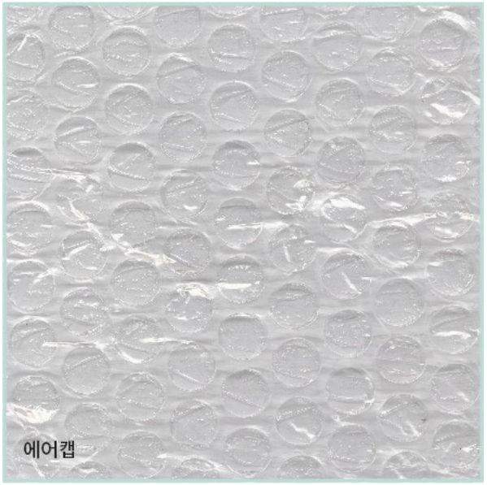
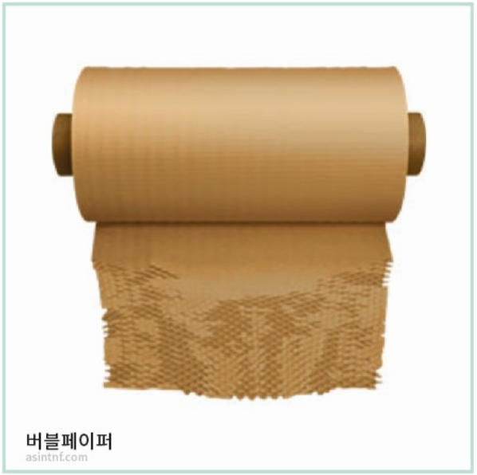
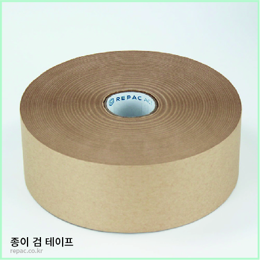
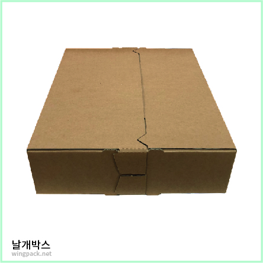
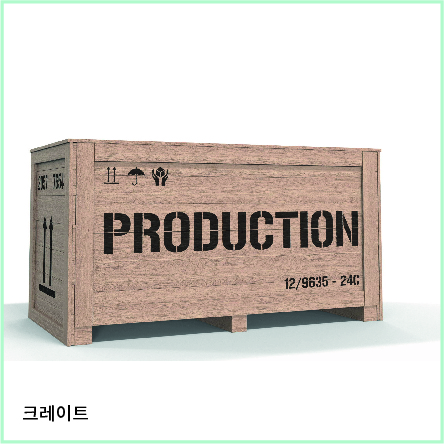

[[_TOC_]]

# 작품 포장

이 장에서는 작품포장에 흔히 사용되는 일회용 물품들의 주재료와 그것이 환경에 미치는 영향, 그리고 대안 재료의 현황에 대해 살펴본다. 비대면 시대가 가속화되면서 포장재가 환경에 미치는 문제는 일상의 영역 깊숙이 확장되어 있다. 절약과 재사용, 재사용을 위한 모듈화, 철저한 분리수거 역시 대안 재료 만큼이나 환경적으로 발전적인 방법일 것이다. 

## [에어캡](에어캡)

작품의 물리적 손상을 방지하기 위해 주로 사용하는 포장재로 투명한 PE사이에 공기가 주입되어 있다. 최초에는 단열 효과가 있는 벽지로 개발된 것이라고 한다. 현재는 단열재와 포장재로 주로 이용되고 있다.

### 주재료
에어캡의 주재료는 저분자 폴리에틸렌이다. 폴리에틸렌은 플라스틱을 얇게 만든 것으로 재활용 처리가 가능한 재료이기는 하나, 아크릴이나 폴리프로필렌 등 타 소재와 결합되지 않는 점[1](#fn1)
, 환경호르몬이 검출되는 점, 수집과 분류, 세척, 재활용 과정에서 탄소가 발생하는 점 등을 고려해야 할 재료이다. 특히 에어캡과 함께 포장에 사용하는 테이프의 주 소재는 아크릴로, 비닐에 붙을 경우 분리배출이 어렵다. 

### 대안적 재료
에어캡을 대체할 수 있는 재료로는 종이를 벌집모양으로 커팅하여 완충역할을 하는 종이완충제(버블페이퍼)[2](#fn2), 종이를 아코디언 형식으로 구겨서 완충역할을 하는 완충제(제품명 페이퍼사우르스)[3](#fn3) 등이 있다.

 
## 비닐
작품을 오염과 먼지, 수분으로부터 보호하는 역할을 한다. 최초에는 PVC폴리염화비닐을 함유하는 합성수지 또는 플라스틱을 비닐로 불렀으나, 최근에는 투명하고 유연한 성질을 가진 합성수지를 비닐로 통칭하는 경향이 있다. 따라서 PP(폴리프로필렌), OPP(연신폴리프로필렌), PE(폴리에틸렌), 그리고 ‘OTHER’로 표기되는 다양한 물질이 비닐로 함께 불리고 있다. 이 중에는 PE와 PVC처럼 서로 섞이지 않는 물질도 많기 때문에 다종 비닐의 사용은 비닐 재활용을 더욱 어렵게 만들고 있다.

### 비닐의 재활용
비닐은 원칙적으로 물질재활용(비닐을 녹여 다시 비닐로 만드는 방법)과 에너지회수(비닐을 압축하여 고체연료로 만드는 방법), 화학재활용(비닐을 열분해하여 다시 석유로 만드는 방법)이 있다. 물질재활용의 경우 비닐에 사용되는 재료가 섞이거나 비닐에 색이 들어가 있는 경우, 이물질이 묻은 경우에 재활용이 어렵고, 수도권에는 비닐처리시설이 많지 않아 분리배출을 잘 해도 재활용되지 않는 비율도 높다. 에너지 회수와 화학재활용도 비닐 재활용의 좋은 방법이지만 비닐을 이용한 고체연료를 사용할 때 대기 오염이 발생하며, 국제유가 하락으로 비닐의 생산비용보다 화학재활용비용이 높은 실정이다. [4](#fn4)[5](#fn5)

### 대안적 재료
비닐을 대체할 수 있는 재료로는(사용 목적이 작품의 보호일 때) 미네랄페이퍼가 있다. 채석장에서 버려지는 자투리 석회석을 재활용해 만들어지는 미네랄페이퍼는 수분과 오염으로부터 작품을 보호할 수 있으며, 나무를 소비하는 종이의 훌륭한 대체품이기도 하다.[6](#fn6)

## 완충재
스티로폼과 플라스틱 소재로 만들어지는 완충재는 박스나 크레이트 안에 들어가 작품의 손상을 막는 역할을 한다. 그러나 스티로폼은 색상에 따라 재활용이 어려운 경우가 많고[7](#fn7), 알갱이가 바다로 흘러갈 경우 생태계를 교란하기 쉽다.[8](#fn8)

### 대안적 재료
완충제를 대체하기 위해 최근 옥수수나 종이를 이용한 제품들이 생산되고 있다. 하지만 녹말 성분으로 만들어진 완충제는 습기에 매우 취약해 작품과 직접 닿게 포장하면 녹아서 붙을 수 있으니 주의해야 한다.[9](#fn9)

## 테이프
아크릴이나 OPP소재에 접착제를 발라 만들어지는 테이프는 그 자체로도 재활용이 어렵지만 비닐이나 종이에 붙은 것이 잘 제거되지 않을 경우 다른 물질의 재활용도 어렵게 만든다.

### 대안적 재료
이를 대체하기 위해 최근 생산된 종이 검테이프는 크라프트지에 녹말 접착제를 도포한 제품으로, 종이 박스에 붙일 경우 그대로 재활용이 가능하다.[10](#fn10) 테이프를 사용하지 않고 박스의 끝을 날개형으로 제작하여 옆면에 끼우는 형태로 봉할 수 있게 하는 ‘날개박스’ 또한 훌륭한 대안이다.[11](#fn11)

## 크레이트
작품의 장기 보관이나 장거리 운송을 위해 제작하는 크레이트는 작품마다 맞춤으로 제작하게 되고 작품의 약 2배 부피를 가지므로 운송이 종료된 후 다른 크기의 작품에 재사용하거나 보관하는 것이 어렵다.
크레이트에는 외장재 등급의 합판, 각목, 목공용 접착제, 금속 볼트와 너트, 완충제가 사용된다. 다양한 재료를 복합적으로 사용할수록 재활용 가능성은 낮아진다. 
*각 재료의 내재에너지와 장단점은 ‘공간구성' 항목의 ‘재료'를 보라.

### 대안적 재료
크레이트 사용의 대안으로는 여러 작품에 공동으로 사용할 수 있도록 크기의 규격화를 하는 것, 사용되는 재료의 양을 줄이는 것, 모듈형 크레이트를 개발하는 것 등이 있다.

## 각주
1PE와 PP를 하나로 녹이는 물질은 개발되지 않아 재활용 비율이 2퍼센트에 그친다. 아래 관련 기사 참조. '플라스틱 재활용 혁명 일어날까?', 사이언스타임즈, 2017년 2월 28일자. https://www.sciencetimes.co.kr/news/%ED%94%8C%EB%9D%BC%EC%8A%A4%ED%8B%B1-%EC%9E%AC%ED%99%9C%EC%9A%A9-%ED%98%81%EB%AA%85-%EC%9D%BC%EC%96%B4%EB%82%A0%EA%B9%8C/

2(주)아신티엔에프사의 '버블페이퍼 네추럴' 상세 페이지. http://www.asintnf.com/paperbubblenaturalDesc

3(주)아신티엔에프사의 '페이퍼사우르스' 상세 페이지. http://www.asintnf.com/PAPER-SAURUSDesc
4화학재활용도 하나의 대안이지만 궁극적인 대안이 될 수는 없다. 아래 관련 내용 참조. '비닐은 어떻게 재활용이 될까?', 자원순환사회연구소 네이버 블로그, 2020년 10월 10일자. 
https://blog.naver.com/waterheat/222111511680
5화학재활용보다는 분리배출단계의 정상화가 중요하다. 아래 관련 내용 참조. '우리는 ‘재활용 지옥’에 떨어지고 말았구나', 시사인, 2021년 1월 7일자. https://www.sisain.co.kr/news/articleView.html?idxno=43602
6'돌이 종이가 된다? 젖지 않는 종이, 미네랄 페이퍼', 한국에너지공단 네이버 블로그, 2020년 11월 27일자. https://blog.naver.com/kea_sese/222155865059
7''스티로폼'은 재활용이 가능할까? 불가능할까?', 그린포스트코리아, 2018년 8월 23일자. http://www.greenpostkorea.co.kr/news/articleView.html?idxno=95357
8미세플라스틱 주범인 스티로폼, 제주 해양생태계 빨간 불', 녹색연합 보도자료, 2020년 9월 9일자. http://www.greenkorea.org/activity/living-environment/zerowaste/84182/
9'‘생분해뽁뽁이, 옥수수완충제‘ 기업들의 친환경 행보', 베이비타임즈, 2020년 2월 17일자. http://www.babytimes.co.kr/news/articleView.html?idxno=33195
10지구를지켜라 리팩 사이트 내 ‘친환경 종이 검 테이프’ 상품 페이지. https://repac.co.kr/28/?idx=18
11에코라이프패키징 사이트 내 '무접착형 낱개박스' 상품 페이지. https://wingbox.kr/goods/catalog?code=00010005