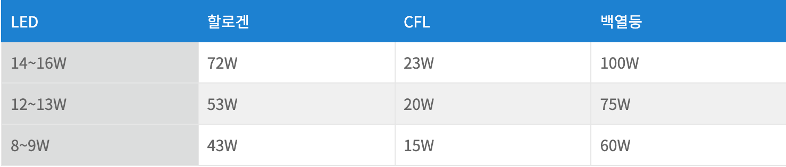
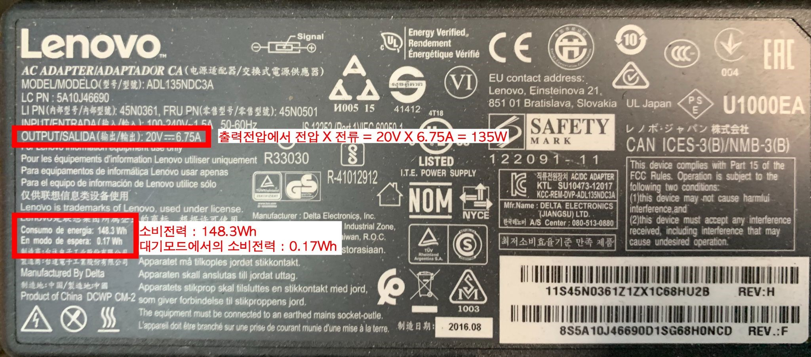
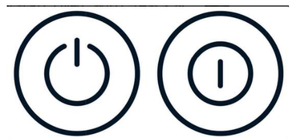

[[_TOC_]]

#  전시 운영

전시를 만드는 과정에서만큼이나 전시를 유지하고 운영하는데도 많은 에너지가 사용되고, 이는 탄소 발생으로 이어진다. 이번 장에서는 조명, 온습도유지, 영상작품의 구동, 프로그램 운영, 티켓 발권 등 전시를 운영하는 데 소요되는 에너지와 그 대안에 대해 생각해볼 것이다.

## A.	에너지 사용

### 1.	조명
조명은 전시공간의 분위기를 조성하고 작품에 집중할 수 있도록 해주는 도구이다. 이 장에서는 조명이 직접적으로 환경에 미치는 영향보다는 조명의 에너지 사용량, 즉 탄소 발생량을 주로 살펴보았다. 조명은 전시뿐 아니라 일상생활에서도 필수적 요소다 보니 수명이 길고 소비전력이 적으며 빛, 색이 다양한 많은 조명기구가 개발되고 있다. 전시공간에 새로운 조명 시스템의 도입을 위해 기반시설의 교체가 필요한 경우 정부나 지자체의 지원사업도 다양하게 마련되어 있다.

 
동일한 빛을 내기 위해 소모되는 전력량 

#### a.	할로겐
할로겐(Halogen)은 백열전구의 한 종류로서, 유리구 안에 할로젠 물질을 주입하여 텅스텐의 증발을 더욱 억제한 램프이다. 백열전구에 비해 더 밝고 환한 빛을 내면서도 수명이 오래 가며 크기도 작고 가벼워 자동차 전조등, 무대 조명, 인테리어 조명의 광원으로 많이 사용된다.[61](#fn61)  특히 주광색 할로겐의 경우 자연광과 거의 흡사한 백색을 내기 때문에 미술관 조명으로 각광 받아왔다.
##### i.	 전력량
2007년 UN에서 퇴출권고를 내린 백열등 다음으로 높은 전력을 소모하는 할로겐 램프는 2016 EU에너지등급평가 최하위 등급인 D등급을 받았고, 유럽에서는 2018년부터 할로겐 램프 제품 신규 생산을 금지시켰다. [62](#fn62)

#### b.	형광등
진공으로 된 유리관에 수은과 아르곤 가스를 넣고 안쪽 벽에 형광 도료를 칠하여, 수은의 방전으로 생긴 자외선을 가시광선으로 바꾸어 조명하는 등을 뜻한다.  [63](#fn63)

##### i.	장단점
백열등 소비전력의 1/3 정도이다. 또 빛이 부드럽고, 수명도 5~6배(약 3,000시간) 길다. 주위의 온도에 의하여 특성이 변동하며, 0~40℃ 범위 외에서는 점등하기 어렵고 밝기가 저하된다. 수명이 지난 형광등은 형광물질이 열하하여 광속(光束)이 감퇴하므로 비경제적이다.

#### c.	컴팩트 형광전구
컴팩트 형광전구(Compact Fluorescent Lamp, 이하 CFL)는 형광등을 저전력형으로 개조한 형광등이다.
##### i.	장단점
전력량이 25%이고, 수명이 더 길어 차세대 전구로 각광 받았다. 그러나 램프 안에 수은을 포함하고 있어 폐기시 심각한 환경문제를 초래하며, 파장에 자외선을 포함하고 있다. 영국 보건국(HPA)은 컴팩트 형광전구(CFL)를 사용할 때 하루에 1시간 이상, 30cm 이내에서 이 전구로부터 나오는 빛에 노출되면 피부가 붉게 변하는 등 피부질환이 생길 수 있다며 사용에 주의할 것을 당부했다. [64](#fn64)

#### d.	엘이디(LED)
엘이디(Light Emitting Diode, 이하 LED)는 전류를 순방향으로 흘려주었을 때, 빛을 발하는 반도체 소자이다. 전자 시계, 버스 전광판, 전등, 가로등, 무대조명, 식물 광합성 등 다양하고 넓은 분야에 사용한다. 

##### i.	 장점
LED를 만드는 반도체의 종류를 바꾸면 그 물질의 띠틈에 따라 다양한 색깔을 낼 수 있으며, 특정한 파장을 비교적 정확하게 만들어낼 수 있다. 또한 같은 전력으로 더 많은 빛을 낼 수 있다. 즉 발광 효율(luminous efficacy)이 좋다. 일반적인 백열등은 100W에서 15lm/W정도이고, 형광등은 100lm/W를 넘는 것이 쉽지 않지만, 발광효율이 100lm/W보다 큰 LED가 많이 나와 있다. 전류를 흘려주고 난 후, 마이크로초 정도의 짧은 순간에 최대 밝기로 빛을 낸다. 백열등이나 형광등보다 수명이 길고, 외부 충격에 잘 견딘다. [65](#fn65)

빛의 색이 다양하게 개발되기 전 LED는 미술 전시용으로 적합하지 않다는 인식이 있었으나, 이제는 다양한 파장과 빛색이 개발되어 오히려 할로겐보다 정확하고 섬세한 빛, 색 선택이 가능하다. 
또한 전구와 시설비용이 높은 것이 단점이었으나, 에너지 복지사업의 일환으로 각 지자체마다 LED교체 지원사업을 활발히 시행 중에 있다.

#### e.	자연광
자연조명은 전시 환경적 측면에서는 매우 효과적이나 조도의 유지가 힘들고 전시물의 보존적 측면에서는 위험한 요소이다. 
미술관의 로비, 전이공간 등에서는 충분히 자연광 사용이 가능하며 빛으로 인한 작품 손상의 우려가 상대적으로 적은 현대미술 공간에서도 자연광을 적극적으로 고려할 수 있다. 그러나 이는 건축 초기부터 자연광원의 사용이 계획되어야만 가능하다는 단점이 있다.  [66](#fn66)

#### f.	기타 대안
##### i.	알루미늄 반사판
전시 <Nature’s Nation>은 조명이 소모하는 에너지량을 리서치하던 중, 평소 사용하던 할로겐 램프 대신 LED램프와 포물선 형태의 알루미늄 반사판을 제작하여 작품을 조명했고, 84일의 전시기간 동안 전기 사용량을 12분의 1로 줄였다
##### ii.	필름 반사판
알루미늄 반사판의 단점(후면빛을 반사시키기 어려움)을 보완한다. [67](#fn67)
 
    
### 2.	전시 유지 장비
수장고의 항온항습기처럼 작품의 동일성을 유지하기 위해 필수적인 장비와 보안을 위한 장비 또한 논외로 한다. 그러나 지난 20년 사이 에어컨의 소비전력량이 눈에 띄게 줄은 것 처럼, 절전의 수요가 늘면 항온항습기의 소비전력량을 절감하는 기술 또한 개발될 것이다.

### 3.	전시 상영 장비
영상이나 사운드 작품을 전시하기 위해 사용되는 프로젝터나 스피커, 모니터, 컴퓨터 등의 전자 장비의 기종은 작품의 퀄리티와 연결되어 있기 때문에 논외로 한다. 그러나 전력량 소모가 큰 고사양의 장비를 대량으로 사용하는 전시의 경우 장비의 손쉬운 ON/OFF 설정과 상세한 매뉴얼화 만으로도 전력 사용량을 크게 줄일 수 있다. 실제로 복잡한 설정의 시청각 장비의 경우 재설정의 부담 때문에 심지어는 전시 기간 내내 켜두는 경우도 있다. 이 부분에 대해서 아래 4번 ‘에너지원(Energy Resources)’을 참고하기 바란다. 

### 4.	에너지원(Energy Resources)
#### a.	전력량 계산의 필요성
전시에서 전력량을 계산하는 과정이 상호 합의에 의해 공유되고 파악된다면, 작품과 전시를 만드는 데 있어 에너지 소모에 대한 부분을 조금이라도 인식하고 고려할 수 있을 것이다. 
전기에너지를 쓰는 작업의 경우, 전력 사용량을 합산하고 그 데이터를 공유하는 단계를 마련하는 것이 전시를 운영하는 입장에서, 동시에 작품을 만드는 입장에서 에너지 소모량을 가늠할 수 있다. 전시 공간의 전기 최대 공급량이 모두 다르고, 그 한계에 대비하기 위해 미리 작가에게 작품의 전력 사용량을 요청하는 경우가 종종 있다. 전시 공간이 야외거나 부스가 많은 박람회, 일반 가정집처럼 전시 특화를 위한 공간이 아닐 때 특히 그렇다. 공연에서는 테크니컬 라이더를 주고받기도 하는데, 이때에도 소모전력량을 기재해야 하는 경우가 있다. 
여태까지 작품의 전력량 계산은 전시 공간의 전기 공급량이 초과하지 않는지를 검토하는 차원에서 이루어져 왔고, 위에서 언급한 특별한 경우가 아니라면, 작가가 원하는 장비를 쓰지 못한다든지 작품을 수정해야 하는 등, 이 정보가 창작을 제한하는 기준으로 작동하는 사례는 많지 않았다. 작품이 원활하게 돌아가는 것을 우선으로 발전차를 임대하는 등 대비책이나 해결책을 마련하려는 목적이었다. 
그래서 특별한 경우가 아니라면 일반 전시장에서 전력 사용량 계산은 자주 생략되어 왔고, 불필요한 단계로 인식되기도 했다. 전기 에너지에 대해서는 그 유한성에 대해 고민하지 않았음을 방증하는 것이기도 하다. 
비단 전시뿐만 아니라 일상생활도 마찬가지이다. 멀티탭에 전기제품을 과도하게 꽂아두면 위험하다는 것[68](#fn68)
 에 대해 다들 들어는 봤지만 정확한 그 기준에 대해서는 잘 모르거나, 실천으로는 연결되지 않는 것이 결국 똑같이 전시장으로도 이어지기 때문이다. 또한 전력이라는 개념을 파악하는 것은 단순히 에너지 절약의 차원의 문제가 아니라 안전과도 밀접한 연관이 있다. 

#### b.	전력량 계산 방법 
전력량은 전력(W, kW)에 시간(h, hour)을 곱한 개념이다. Watt(와트)라는 단위를 쓰는 전력은 전압(V)과 전류(A)를 곱한 값으로 계산되는데, 프로젝터, 노트북, 모니터 등 전자제품의 형태라면 모델명으로 검색하여 소비전력을 확인할 수 있다. 만약 세부정보에 나와있지 않다면, 아답터에서 확인가능한 전압과 전류의 수치를 곱하여 최대전력을 계산하고, 이 수치로 소모전력을 가늠해볼 수 있다. 

모니터 아답터 뒷면, 소비전력이 명시되어 있다면, 그 수치로, 만약 없다면 아답터의 출력에 명시된 전압-전류의 수치를 곱하여 최대전력을 계산하여 활용한다. 

구분 | 소비전력 
----------- | -------
|1.	맥북프로 노트북 * 2 | (아답터에 명시된) 최대소비전력 85W * 2 = 170W |
| 2.	모니터 * 2 | 120W * 2 = 240W  |
| 3.	아두이노 * 2 | 9W * 2 = 18W |
|4.	액티브 스피커 * 2  | 80W * 2 = 160W |
| 합계 | 170W + 240W + 18W + 160W = 588W |
 
 
하나의 미디어 작업에 사용되는 장치의 소비전력을 합산한 사례 

전력량은 앞서 말한대로 위 합산된 전력에 시간(h)을 곱하는 방식으로 산출된다. 만약에 하루를 기준으로 전력량을 계산한다고 하면, 1일 전시시간을 곱하여 산출하면 된다. 혹은 1시간을 기본으로 생각하고, 전력량이 아닌 전력(W, kW)의 수치로 공유해도 무방할 것이다. 
위 사례는 하나의 제안일 뿐, 테크니션, 전문적인 전기팀/부서가 상주하는 전시장, 공연장에서 전력량을 합산하고, 요구하는 기준이나 형식은 다를 수 있다. 

#### c.	전기 에너지 절약 
##### i.	에너지 소비효율 등급
전시에 사용되는 전기제품을 구매할 때, 에너지 소비효율 등급을 가장 낮은 것으로 선택하는 것은 에너지 절약을 위한 가장 기본적인 방법 중 하나다. 에너지 소비효율이 높을수록 제품의 가격은 올라가지만, 궁극적으로 전기세를 감면할 수 있기 때문에 오랜 시간 자주 사용하는 장비라면 이 등급을 기준으로 선택한다. 

#### d.	적절한 장비 선택 및 환경 구성
작품에 따라 장비의 활용은 상이하겠지만, 다음과 같이 몇 가지로 분류하여 환경적인 접근을 고민해볼 수 있다. 
##### i.	영상 재생 시
반복 재생 등 단순 영상 재생을 위한 용도라면 DivX 영상 플레이어나 저전력 기반의 PC, 모바일 기기와 같은 소모전력이 가벼운 장치를 사용한다. 
##### ii.	사무용 PC
갤러리, 미술관 내 사무공간과 같은 일반 오피스 환경에서는 데스크탑 형태의 PC 보다는 노트북을 사용하거나, 아래 언급하게될 씬클라이언트를 시스템적으로 구축하는 것으로 전력을 줄일 수 있다.
##### iii.	임베디드 시스템의 활용
##### iv.	소형 컴퓨터 활용
영상 재생뿐 아니라 센서의 입력이 필요하다든지 비교적 간단한 컴퓨팅이 필요한 경우가 있다. 데스크탑 형태의 PC를 두는 것 보다는 라즈베리 파이(Raspberry Pi) 등 소형 컴퓨터를 활용하여 특정 기능을 수행하는 임베디드 시스템을 구현하는 것으로 소모전력을 줄일 수 있다. 

#### e.	대기전력 
전기제품을 사용하지 않고 플러그를 콘센트에 그냥 꽂아 두기만 해도 소모되는 전력을 말한다. 전기로 가동되는 장비 (특히 미디어 아트 등의 전시에서)의 경우 사용시 소모되는 전력 이외에도 플러그에 꽂아놓는 것만으로 소비가 되기 때문에 휴관일이나 전시를 하고 있지 않은 경우 전력 사용을 완전히 차단할 필요가 있다. 24시간 가동이 필요한 보안 목적의 CCTV, 응급 서비스 관련 등의 전력은 제외한다.
##### i.	타이머 사용
전시 시간이 정해져 있을 경우, 자동으로 전원을 차단해주는 타이머를 설치한다.
##### ii.	대기전력 저감 프로그램
전자제품을 사용하지 않을 때 소모되는 대기전력(Standby Power)을 저감시킨 대기전력저감 우수제품의 보급을 확대하고 관련 기술의 개발을 촉진하기 위한 의무적인 신고제도. [69](#fn69)

##### iii.	대기전력 표기

  
(그림 설명 좌: 전원을 꺼도 대기전력 소비 / 우: 대기전력을 소비하지 않음)
iv.	대기전력 소모량이 많은 예
인터넷 모뎀, 에어컨, 보일러, 오디오 스피커, 비디오, 공유기 등이 있다.

#### b.	배터리 
##### i.	전지의 분류
전지는 전시에서 활용되는 배터리는 크게 리튬 폴리머(LiPo)[70](#fn70)
  같은 충전식 배터리와 AAA, AA 같은 일반 일회용 건전지로 나눌 수 있다. 
일회용 건전지를 1차 전지(disposable or primary battery), 충전과 방전이 가능한 전지를 2차 전지(secondary cell, rechargeable battery)[71](#fn71)
 로 구분한다. 
1차 전지에는 전체 전지의 90% 이상을 차지하는 망간 건전지와 알카라인 건전지가 있다. 
2차 전지는 보통 하나 이상의 전기화학 셀로 구성되어 있다. 니켈 카드뮴(NiCd), 니켈 수소(NiMH), 리튬 이온(Li-ion), 리튬 이온 폴리머(Li-ion polymer, LiPo), 산화은(silver oxide), 수은 전지(mercury battery) 등이 있다. 당연히 일회용보다는 충전하여 다시 쓰는 방식이 환경에는 훨씬 더 적은 영향을 끼친다. 하지만 2차 전지 중에는 1차 전지보다 더 유해한 물질을 함유하고 있는 것도 있기 때문에 반드시 분리배출이 필요하다. 
##### ii.	폐전지로 인한 환경 오염  [72](#fn72)

폐전지는 분리배출이 잘 되지 않고 생활쓰레기로 자주 버려지고 있다. 1차 건전지의 경우 납과 수은 등의 유해물질은 없지만 망간, 아연, 철, 니켈 등을 포함해 그대로 매립하면 토양과 지하수가 오염될 수 있다. 또한 소각 시 망간과 아연 등을 함유한 배기가스로 인하여 대기가 심각하게 오염되기도 한다. 이보다 더 큰 문제는 수은과 카드뮴 등의 유해물질을 함유하는 2차 건전지까지 생활쓰레기로 버릴 경우 망간폐렴, 카드뮴 중독, 수은 중독 등 치명적인 질병으로 이어져 인간과 환경에 더욱 치명적이라는 점이다. 
##### iii.	폐전지의 처리 
1차 전지와 2차 전지 모두 생활쓰레기가 아닌 가까운 폐전지 수거함으로 분리배출해야 한다. 각 시, 군에서 수거한 폐건전지는 (사)한국전지재활용협회[73](#fn73)
 로 보내져 이곳에서 종류별로 선별하고 재활용 처리[74](#fn74)
 를 거친다. 재활용 가능한 금속물질을 회수하고, 잔여 폐기물은 안전하게 처리한다. 이 협회에서는 폐건전지 관련 환경교육을 운영하기도 한다. 

#### f.	 시스템적 접근 
다음은 개인 단위에서 접근하기는 어렵지만 그럼에도 대형 미술관, 공공기관 차원에서 고민해볼 만한 방법들이다. 
##### i.	씬 클라이언트 
씬 클라이언트는 클라이언트 측에서 처리하지 않고 서버에서 해결하는 시스템이다. “메모리 등 필수적인 하드웨어 장치만 탑재해 네트워크로 연결된 중앙서버에서 모든 업무를 관리하도록 설계되었다.”[75](#fn75)
  씬 클라이언트의 장점으로 대용량 저장공간이 필요없고 기존의 PC중심의 시스템보다 에너지를 덜 소비하며, 공간의 난방 부하를 낮추고, 컴퓨터 팬을 사용하지 않아 더 조용한 환경을 만들 수 있다는 점을 꼽을 수 있다. 
##### ii.	팻 클라이언트
씬 클라이언트와 반대되는 개념의 팻 클라이언트(fat client)가 있다. 중앙 서버에 연결하지 않고 자체적으로 실행하는 것을 뜻한다. 팻 클라이언트는 컴퓨터 및 소프트웨어 라이센스 비용이 감소하고 응용 프로그램을 로컬에 저장하기 때문에 실행이 빠를 수 있는 장점이 있다. 데이터 전송과 서버를 사용하는 환경의 전시라면 씬 클라이언트와 팻 클라이언트 중 적합한 방법을 선택해야 한다. 
##### iii.	대체에너지 활용
본 매뉴얼에 언급된 에너지는 주로 전기 에너지를 중심으로 작성되었다. 전기 에너지를 생산하는 방식은 여러가지가 있는데 우리나라의 경우, 재생에너지를 활용하여 발전하는 비율은 세계 평균의 절반에도 못 미치고, 석탄발전 감소폭도 주요 20개국(G20) 중에 가장 뒤처지는 실정이다.[76](#fn76)
  국가 전력의 66%를 공급하고 있는 화석 연료는 심각한 환경 문제를 일으키고, 매립 자원의 한계가 있다는 문제점이 있다. 이 때문에, 이를 대체할 에너지에 대한 개발이 이루어지고 있고, 환경을 파괴하지 않는 것이 중요한 기준으로 고려되고 있다. 특히 태양열, 바이오 에너지, 풍력 발전 등의 재생에너지가 대표적이다. 
하지만 대체에너지를 전시에 적용하기에는 아직 어려움이 많다. 예를 들어, 미술관이 태양광 에너지로 전력을 공급하려면 태양광 패널 등 관련 설비를 마련해야 하고, 이는 건축의 영역과도 밀접하게 연결된다. 전시를 운영하기에 충분한 전력을 공급하기 위해서는 패널의 크기와 비용, 계절에 따른 일조량의 변화 등 다양한 요소도 고려해야 한다. 태양열을 전원으로 쓰는 미디어 작업도 종종 있는데, 태양광을 전기 에너지로 전환하는 태양광 패널의 종류가 아주 다양하지 않고, 가격도 싸지 않다. 에너지 효율도 높은 편이 아니라서 패널의 크기, 충전 시간, 발전량 등 작품 창작에 있어 아직은 제한 사항이 많은 것이 현실이다. 그럼에도 비전력 메커니즘을 고민하거나, 대체에너지를 전시공간에 적용하려는 시도와 연구는 앞으로 필요해 보인다. 

## B.	운영 루틴

### 1.	방법
전시 공간을 매일 동일한 조건으로 유지하기 위해 매뉴얼을 만든다. 운영시간, 적정온도, 켜야 하는 조명 스위치의 종류, 각종 영상장비를 켜고 끄는 법 등을 적는다. 여러 장비의 사용으로 에너지가 무방비하게 새는 경우를 파악해야 한다. 
장비를 다루는 방법이 매우 복잡한 경우 세팅의 유지, 혹은 전시공간의 미감을 위해 전선과 장비를 매립하기도 하는데, 이 경우 장비를 켜고 끄는 것이 물리적으로 어려워 전시기간 내내 켜두는 경우도 있다. 
또한 코로나19 이후 손으로 만지는 장치가 많은 전시공간에서는 일회용 비닐 장갑, 헤드셋 사용시 착용하는 이어캡 등의 일회용품 사용량도 늘어나고 있다. 

### 2.	대안
매뉴얼의 단순화, 전시공간 설계시 스위치의 위치를 고려. 헤드셋의 경우 개인용품 사용을 권장한다.

## C.	기타

### 1.	오프라인 프로그램
전시와 연계된 프로그램을 오프라인으로 진행할 경우, 사람들의 이동, 공간의 냉난방, 1회용품 배포 등에서 탄소가 발생한다. 그러나 온라인 진행만이 능사는 아니다. 참여자마다 데이터 환경이 상이하며 전력과 서버 사용에 따른 탄소 발생이 존재하기 때문이다. 

### 2.	윈도 갤러리
전시공간이 문을 닫은 후에도 윈도 갤러리(Window Gallery)의 작풍은 지나다니는 사람들이 볼 수 있도록 조명 및 전기 장치를 24시간 켜두는 경우가 많다. 또한 윈도 갤러리의 조명은 한낮처럼 조명이 필요 없는 시간에도 동일한 세팅으로 구성되어 있어, 운영 시간이나 조명 시간을 정하는 등을 고려해야 한다. 

## D.	 리플릿, 종이티켓 발권 등의 관습

IV 홍보/디자인 항목의 E. 각종 인쇄물 페이지 참고.

## 각주

61.  '할로젠램프' 두산백과 용어 안내 페이지. https://terms.naver.com/entry.naver?docId=1224849&cid=40942&categoryId=32340

62. 유럽 내달부터 할로겐등 금지령…LED전구 전면 확대', 연합뉴스, 2016년 8월 24일자. https://www.yna.co.kr/view/AKR20180824048400009

63. '형광등' 두산백과 용어 안내 페이지. https://terms.naver.com/entry.naver?docId=1163299&cid=40942&categoryId=32377

64. “에너지 절약형 CFL전구 피부질환 위험”, 코메디닷컴, 2008년 10월 10일자. http://kormedi.com/1186771/%EC%97%90%EB%84%88%EC%A7%80-%EC%A0%88%EC%95%BD%ED%98%95-cfl%EC%A0%84%EA%B5%AC-%ED%94%BC%EB%B6%80%EC%A7%88%ED%99%98-%EC%9C%84%ED%97%98/

65.   '발광다이오드' 두산백과 용어 안내 페이지. https://terms.naver.com/entry.naver?docId=5741416&cid=60217&categoryId=60217

66. 유보은, <박물관 · 미술관의 조명환경에 관한 연구 - 자연조명을 중심으로>, <<박물관학보>> 통권 제7호, 2004, pp.325~344.

67. '잉크테크，조명도 2배 높이는 ‘필름형 반사판’ 개발', 파이낸셜뉴스, 2009년 5월 8일자. https://www.fnnews.com/news/200905082050459515

68. 건축물에 따라 상이하지만, 일반 가정집에서 하나의 멀티탭이 꽂히는 벽 콘센트의 허용 전력은 3300W 정도이다. 전압을 220V로, 정격전류를 15A로 보고 산정한 것이다. 열을 사용하는 전자 제품일수록 전력이 높은데, 예를 들어, 전자레인지 1000W, 전기포트 1500W, 식기세척기 2100W라고 하면 이 3개를 합하면 벌써 3KW가 훨씬 넘는다. 즉 소비전력이 높은 전자제품을 한 멀티탭에 꽂는 것은 멀티탭과 벽 콘센트가 감당할 수 있는 최대치에 근접하거나 초과할 수도 있는 것이다. 만약에 이 세 가지 장비가 동시에 작동된다고 하면 최대전기공급량을 초과하여 멀티탭에 무리가 가거나 누전차단기가 내려가는 현상 등이 발생할 수 있다. 만약 이런 차단 장치가 없거나 제대로 작동하지 않는다면 분전함의 전선이나 멀티탭의 과열로 인해 화재가 일어날 수도 있다. 이런 연유로 소비 전력과 사용량, 사용방식 등 에 대해 주의를 기울일 필요가 있다.

69. 대기전력에 대한 더 많은 자료. https://eep.energy.or.kr/business_introduction/standby_summary.aspx

70.   충전용 배터리로 자주 사용되는 리튬 폴리머는 카드뮴, 납, 수은 등 환경 규제물질을 포함하지 않아서 환경 친화적이라는 장점을 갖고 있다. 또한 다른 2차 전지에 비해 용량이 커서 더 많은 전력을 사용할 수 있다. 사용하지 않아도 시간이 지나면 방전되는 자연방전, 완전 방전되지 않은 상태에서 충전을 반복하면 최대 용량이 줄어들어 메모리 효과도 거의 없다. 하지만 오랜 시간 충전을 방치하면 열 발생 및 스웰링(swelling, 고체 안에 기체가 발생함에 따라 부푸는 현상)이 발생할 수 있어 과충전 하지 않도록 주의한다. 스웰링이 발생한 리튬 폴리머 배터리는 폭발 사고가 일어날 수 있으므로 과감하게 버린다. 리포(LiPo) 배터리에서 나오는 유독 물질은 공기와 접촉할 때 발화할 수 있기 때문에 배터리에 구멍이 뚫리지 않도록 주의해야한다. 

71. 'Rechargeable battery' 위키피디아 용어 안내 페이지. https://en.wikipedia.org/wiki/Rechargeable_battery

72. '당신이 버린 폐건전지가 환경을 파괴시킨다', 경기도뉴스포털, 2010년 8월 4일자. https://gnews.gg.go.kr/news/news_detail.do;jsessionid=E4E2E3A077DC5FFA4F7AFC56773EE231.ajp13?number=201008041017487642C048

73.   (사)한국전지재활용협회 공식 홈페이지 www.kbra.net 연락처 02.6954.0666~8.

74.   '환경오염 막는 폐배터리 재활용 기술', 사이언스타임즈, 2020년 2월 21일자. https://www.sciencetimes.co.kr/news/%ED%99%98%EA%B2%BD%EC%98%A4%EC%97%BC-%EB%A7%89%EB%8A%94-%ED%8F%90%EB%B0%B0%ED%84%B0%EB%A6%AC-%EC%9E%AC%ED%99%9C%EC%9A%A9-%EA%B8%B0%EC%88%A0/

75. '씬 클라이언트' IT위키 용어 안내 페이지. https://itwiki.kr/w/%EC%94%AC_%ED%81%B4%EB%9D%BC%EC%9D%B4%EC%96%B8%ED%8A%B8

76. '한국 에너지전환 ‘최하위권’…화석연료 늘고 재생에너지는 ‘찔끔’', 한겨레, 2021년 3월 29일자. https://www.hani.co.kr/arti/science/science_general/988577.html

