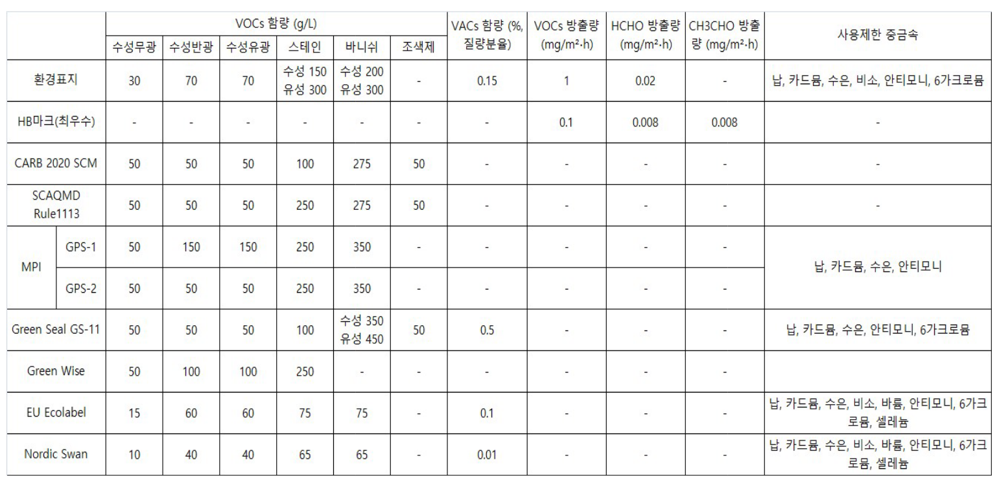

# 전시장 조성

[[_TOC_|levels=3]]

이 장에서는 전시장의 공간구조물을 조성할 때 일반적으로 쓰이는 자재들을 알아보고 각 과정에서 대체할 수 있는 재료 혹은 제품들 사이의 차이점과 각 재료의 선택이 환경에 미치는 영향을 비교하고자 한다.

재료 또는 제품이 환경에 끼치는 영향을 가늠할 수 있는 지표로는 '탄소발자국’, ‘내재 에너지’, ‘내재 물사용량’, ‘전 과정  평가(life cycle assessment, 이하 LCA)’ 등이 있는데, 이 매뉴얼에서는 재료 간의 환경영향을 비교하기 위한 기준으로 내재 에너지*를 사용했다.

석고보드, 페인트와 같이 공산품으로 공급되는 재료들은 국내의 친환경 인증 취득 여부를 통해 환경에 미치는 영향을 추가로 기록했다.

그 밖에 환경에 끼치는 영향을 조금이라도 줄일 수 있는 선택들과 그때의 유의점도 알아본다.

* 내재 에너지(embodied energy)란
상품/서비스를 자연상태의 원재료에서 최종적인 결과물로 만드는 데 필요한 에너지의 총합을 산출하는 개념으로, 화석연료 소비량 또는 탄소발자국과 유사한 경향성을 가진다. 반면 상품의 생산과정에서 발생되는 유해물질/부산물 등을 처리하는 데 쓰이는 에너지나 쓰임을 다한 상품을 폐기하는 데 드는 에너지는 내재 에너지에 포함되지 않는다는 점에서, 폐기과정까지 아우르는 전체 생애주기에 대한 온전한 평가를 위한 지표로는 충분치 않다는 한계가 있다.
내재 에너지를 비롯하여, 제품의 환경영향 정도를 산출하기 위해서는 원재료 수집부터 운송, 생산과정, 폐기과정 등의 전과정을 상향식/하향식으로 추적하여 얻은 전방위적 자료가 필요한데 이는 정부와 연구기관의 협력 없이는 불가능하다. 국내에는 재료/제품의 환경영향에 관하여 구축된 데이터베이스가 전무[12](#fn12)한 실정으로 본 매뉴얼에서는 해외(영국, 호주)의 데이터베이스를 재료 간 환경영향 상대적인 비교에 사용하였다.

## 목공재료

### 각재 
전시 가벽이나 좌대 등 구조적인 뼈대를 만드는 과정에서 소위 ‘다루끼’, ‘투바이’라고 하는 목재를 사용한다. 이들 각재는 목재의 원산지와 종류, 생산방식, 건조방법에 따라 나눌 수 있다.

#### 원산지에 따른 분류[13](#fn13)

##### 소송
러시아산 소나무를 일컫는다. 미송보다 단가가 높지만, 옹이의 개수와 휨이 적어 대부분의 실내공사에서 주로 사용된다.

##### 미송
북미산 소나무를 일컫는다. 각재는지리적인 측면에서 봤을 때 운반과정에서의 탄소발자국을 낮추기 위해서는 소송을 쓰는 것이 더 유리하다.

#### 생산방식에 따른 분류

##### 원목
베어낸 그대로 가공하지 않은 목재다.

##### 집성재
가공목재로, 길이나 두께가 최종 상품의 크기에 미치지 못하는 재료들을 같은 결 방향으로 접착시켜 만든 가공목재이다. 접착제를 바르고 열로 압착하는 ‘집성’ 과정에서 원목에 비해 유기화합물과 탄소발자국이 늘지만, 잔재들을 활용하기 때문에 재활용 측면에서 이점이 있다.

##### 엘브이엘(LVL)
엘브이엘(Laminated Veneer Lumber, 이하 LVL)은 나무 널빤지를 직교방향으로 켜켜이 접착시켜 만든 합판을 각재 규격으로 재단한 것이다. 휨이 적고 함수율(목재 속 수분 함유율)이 낮은 장점이 있으나, 집성재와 마찬가지로 접착 및 압착 과정에서 유기화합물과 탄소발자국을 남긴다.

#### 건조방식에 따른 분류
##### 건조
목재를 건조실에 넣고 인위적으로 건조시키는 가마건조(kiln-dry, KD) 방식으로 생산된 자재. KD 건조 과정에서 목재 1kg당 1.65kg의 이산화탄소를 발생시킨다.[14](#fn14) 

##### 반건조
자연건조(air-dry, AD) 방식으로 생산된 자재이다. 기계건조 방식에 비해 탄소발자국 총량이 낮다.

##### 비건조
원목재를 건조과정 없이 제재한 것으로, 탄소발자국 총량이 가장 낮다. 각재는 생산되는 시점부터 공기로 수분이 증발하며 자재가 휘거나 뒤틀리기 때문에 가급적 빨리 소비하는 것이 좋은데, 반건조/비건조 각재는 건조 각재에 비해 변형의 속도와 정도가 더 크므로 유의해야 한다.

#### 각재의 재료별 내재 에너지 비교

#### 제안
각재의 일회성 소비를 대체할 수 있는 방법으로, ‘다회용 모듈식 가벽’을 임대 형식으로 시공업체에 의뢰하거나 미술관에서 모듈을 구입해 쓸 수 있다.[15](#fn15)  다만 지역 기반(경남/전남/제주) 업체로 직접 시공이 가능한 지역이 한정적인 것으로 보인다.

### 판재
각재로 뼈대를 만든 위에 판재를 2겹으로 붙인다. 페인트칠로 마감되는 일반적 전시 가벽은 판재로 석고보드를 사용한다. 작품, 모니터 등이 걸릴 벽이나 판재가 무게를 견뎌야 하는 부분에는 1겹째에 석고보드 대신 합판 등의 목재를 붙인다.

#### 판재의 종류
##### 석고보드
석고보드(gypsum board)[16](#fn16)는 배연탈황석고(Flue Gas Desulfurization Gypsum, 이하 FGDG) 와 재활용 종이가 포함된 석고 원지로 이루어져 있다. 기능에 따라 일반/방수/전방수/방화/방화방수/방균/차음/고강도 제품이 유통된다. 전시장 조성에는 일반 석고를 주로 사용한다. 
석고보드 사용의 장점은 낮은 단가, 시공편의성(자재가 가볍고 재단이 쉽다), 마감편의성(페인트로 마감 시 목재보다 작업이 쉽다) 등이 있다.
국내에서 생산되는 석고보드는 전량 KCC와 USG보랄 제품이고, 수입 석고보드는 거의 쓰이지 않는다.[17](#fn17)
 
###### 석고보드의 친환경 인증
KCC와 USG보랄에서 생산하는 모든 석고보드 제품은 HB마크(최우수)와 친환경표지 인증을 획득했으므로, 제품을 선택할 때 친환경 인증은 따로 고려하지 않아도 된다.

###### 석고보드의 폐기와 재활용
석고보드는 이론적으로 100% 재활용이 가능[18](#fn18)하기 때문에, 원료의 생산과정과 폐기/재활용의 측면에서 친환경적인 재료로 분류된다. 재활용률이 99.9%인 콘크리트 폐기물과 마찬가지로 재활용을 통해 부가가치를 창출할 수 있는 잠재력을 가지고 있다. 
하지만 문제는 대부분이 분류되지 않은 혼합폐기물로 매립되고 있다는 점이다(2012년 국내 기준 약 80%로 추정[19](#fn19)). 석고보드의 재활용률이 현저히 낮은 이유는 인식과 정보의 부재로 보인다. 대부분의 공사현장에서 석고보드 폐기물을 따로 분류하지 않고 있다. 매립된 석고는 자연분해 과정에서 황화수소 가스를 생성하고 지하수를 오염시킬 위험도 있어서 지금이라도 국가 차원의 개입과 관련법령의 도입이 시급하다. 
폐석고보드 재활용 업체에 따르면, 아파트 등 대규모 신축공사에서 발생하는 석고보드 잔재만이 재활용되고 있다. 따라서 현재의 시스템에서는 전시장 조성공사에서 생긴 석고보드 폐기물은 재활용을 장담할 수 없다.

##### 합판
합판은 나무를 얇게 뜬 널빤지를 접착제를 발라 직교방향으로 켜켜이 쌓은 뒤 열압착하는 과정을 거쳐 만들어진다. 합판은 석고와 MDF 중 가장 튼튼해서 무게를 많이 받는 부분이나 나사못을 박아 무거운 것을 거는 부분 등에 선택적으로 사용한다. 합판은 페인트 마감 면으로는 적절하지 않기 때문에[20](#fn20)
  1겹째에 합판을 붙이고 2겹째는 석고보드로 마감한다.
  
###### 국내산 합판 vs 수입산 합판[21](#fn21)
국내 합판 제조업체는 총 3곳(이건, 선창산업, 성창기업)이 전부고 그 외의 물량[22](#fn22)은 모두 수입 합판으로 인도네시아, 말레이시아, 베트남, 중국 등지에서 수입한다. 국내산 합판도 원목재를 90% 이상 수입에 의존하기 때문에 수송 측면에서 탄소발자국이 크게 차이 난다고 볼 수 없다. 다만 선창산업에서 국산 원목으로 만드는 합판의 생산을 늘리려는 비전이 있음을 확인할 수 있었다. 
환경성을 고려하는 측면에서 국내산 합판의 중요한 장점으로는 생산업체와 환경등급을 골라서 사는 것이 용이하다는 점이 있다. 반면 수입합판은 ‘동남아산 일반합판’, ‘중국산 일반합판’ 등으로 원산지 정보로만 분류하여 판매하는 목재상이 대다수여서, 환경등급이나 제조회사를 고려해서 구입하는 것이 거의 불가능하다. 같은 목재상에서 같은 제품을 사올 때마다 제조사가 다르거나, 같은 동남아산 합판인데 두께마다 제조사가 다른 경우도 빈번하다.

###### 합판의 친환경 인증
합판, 파티클보드, MDF, OSB 등 생산과정에 접착제가 들어가는 나무판재는 폼알데하이드(formaldehyde) 함량(mg/L)을 기준으로 SE0(0.3이하), E0(0.3초과~0.5이하), E1(0.5초과~1.5이하), E2(1.5초과~5.0이하) 등급으로 나뉜다. 합판의 친환경 등급은 모서리 단면에 찍힌 도장(사진 1)으로 확인할 수 있다. 내부에 쓰이는 합판은 E0 등급 이상의 것을 사용하는 것이 좋다. 
SE0 등급의 합판은 수입산에서는 확인할 수 없었고, 국내 합판제조 3사 모두에서 생산되고 있음을 확인했다. 
환경표지와 HB마크 인증을 받은 합판은 없는 것으로 확인된다. 
이 밖에도 국내 3사는 일부 합판에서 산림관리협회의 FSC-CoC 인증을 받았다.

|폼알데하이드 함량(mg/L) |
| --- | 
|SE0 ≤ 0.3| 
|0.3 < E0 ≤ 0.5|  
|0.5 < E1 ≤ 1.5|  
|1.5 < E2 ≤ 5.0|  

합판 모서리면에 적힌 도장으로 친환경 등급과 제조사, 내외장재 여부를 알 수 있다.

###### 합판의 폐기 및 재활용
합판은 제조과정에서 접착제를 사용하기 때문에 칩(chip)이나 펄프 등 새로운 제품으로 재활용될 수 없고, 소각 기준을 만족하는 폐기물은 ‘에너지 회수’ 과정을 통해 화력발전소의 연료로 처리된다.

##### MDF의 중밀도 섬유판(MDF)
MDF는 가공된 톱밥을 접착제와 함께 열압착을 통해 성형한 판재이다. 페인트 마감도 용이해서 표면마감재로도 쓰인다. 벽의 모서리 등 충격에 취약한 부분에 석고보드를 대신해 사용한다. 섬유판은 원목이나 합판과 달리 결이 없기 떄문에 못이나 나사못을 박기엔 적절치 않다. 
MDF는 국내산이 주로 유통된다. 수입산 MDF의 국내시장 점유율은 2016년 기준 6.1%이다.

###### MDF의 친환경 인증
환경표지 인증을 받은 국내의 MDF 생산업체로는 포레스코(SE0, E0), 한솔홈데코(E0), 선창산업(E0), 동화기업(SE0, E0), 유니드(SE0, E0)가 있다. HB마크를 획득한 MDF 제품은 없는 것으로 확인된다. [23](#fn23)

###### 판재의 폐기 및 재활용
MDF의 생산은 목재 제품들의 생산 잔여물, 폐지, 목재 폐기물 등을 원료로 쓰기 때문에 한편으로는 친환경적이지만, 합판과 마찬가지로 생산과정에서 접착제를 사용하므로 폼알데하이드 등의 유해물질을 발생시키고 새로운 제품으로의 재활용도 어렵다.

#### 판재의 재료별 내재 에너지 비교
 

#### 제안

##### 로스율
석고보드는 다른 판재에 비해 로스율이 크다. 이는 시공성과 관련이 있는데, 새 석고보드를 재단하고 남은 절단면을 다시 쓰고자 할 경우 목공 과정에서 손이 더 많이 갈 뿐 아니라 페인트칠 등의 후속 마감 공정에서도 더 많은 작업을 요하기 때문이다. 공사 시간과 인건비를 더 들여서 폐기물을 줄이는 방법도 있겠지만, 더 좋은 방법은 디자인/계획 단계에서 석고보드의 손실률을 낮추는 것이다. 국내에서 생산/유통되는 9.5T 석고보드는 900*1800, 900*2400(단위:mm)인데, 구조물의 길이와 높이를 자재규격*0.5*n 에 근접하게 계획하면 손실률을 최소화할 수 있다.

##### 겹
뼈대에 붙이는 판재는 일반적으로 2겹을 교차하여 시공하는데, 그 이유는 1)마감 시 평활도가 좋아 매끄러운 면을 얻고 2)구조적으로 일체성 및 안정성을 높이고 3)수년 내에 발생할 수 있는 분절면에서의 크랙을 방지하기 위함이다. 하지만 일반적인 건축공사에 비해 짧은 기간 내에 철거되는 전시장 조성의 특성상, 판재를 1겹만 치는 것도 현실적인 선택지가 될 수 있다. 1겹 시공은 구조적인 문제는 없으나, 판재끼리 만나는 지점을 기준으로 미세하게 벽이 꺾여 보일 수 있다는 점은 감안해야 한다.

### 기타 부자재

#### 접착제(목공본드)
가벽/좌대의 시공에 쓰이는 접착제의 원재료는 물, 폴리초산비닐수지(Polyvinyl Acetate resin, 이하 PVACs)이다. 폴리초산비닐수지(PVACs)는 석유로부터 추출된 화합물이지만 껌의 주재료로 사용될 정도로 독성이 없고 체내에 축적되지 않는 물질로, 자연에서 미생물에 의해 분해될 수 있는 생분해성 물질이기도 하다.

##### 접착제의 친환경 인증
환경표지와 HB마크(최우수) 인증을 획득한 국내 인테리어용 목공접착제 제품은 다음과 같다.

|회사 | 제품명 | 환경표지 | HB마크 |
| --- | --- | --- | --- |
|쌍곰 | 705 | O |♣♣♣♣♣ |
|    | 701 | -  |♣♣♣♣♣ |
|오공 | 205, 277N | O | ♣♣♣♣♣ |
|성우플러스 | 6500, 4360, 370 | O | - |
|유승 | 105 | O | - |

#### 타카못, 피스못
가벽/좌대를 시공하는 과정에서 부재들을 서로 연결할 때 타카못과 피스못을 사용한다. 사용된 못은 폐기물 처리과정에서 자석을 이용해 분류, 재활용된다.

#### 차음재/방음재
전시장 조성에서 영상/음향 작품의 설치로 방음이 필요한 경우, 뼈대를 세울 때 글라스 울(glass wool, 유리 섬유) 등의 단열재를 채워 넣어 시공한다. 글라스 울은 규사, 석회석, 폐유리 등을 고온에서 녹여 섬유화시켜 만든다. 폐글라스 울은 소각처리된다.

##### 차음재/방음재의 친환경 인증
환경표지와 HB마크(최우수) 인증을 획득한 국내/외 글라스 울 제품은 다음과 같다.

|회사 | 제품명  | 	환경표지 | 	HB마크 |  비고 | 
| --- | --- | --- | --- | --- |
| KCC | 	그라스울 | 	O | 	-	 |   | 
|	| 라스울 네이처 |	O |	♣♣♣♣♣ | |	
| 벽산 |	그라스울 |	O |	♣♣♣♣♣ |	|
|생고뱅이소바코리아 |	그라스울 |	O |	- |	EPD, EUCEB 등 유럽 인증 획득 |

##### 대안

###### 셀룰로오스 단열재 시공
글라스 울의 대안으로는 셀룰로오스 단열재가 있다. 셀룰로오스 단열재는 75% 이상이 폐 신문지로 이루어져 있어 친환경적이고, 자연에서 분해된다는 이점이 있다. 내재 에너지 또한 글라스 울 제품의 15~40%로 생산과정에서 환경에 미치는 영향이 적은 재료이다. 하지만 시공 특성상 목공팀에서 소화할 수 없어 따로 단열업체에 시공을 의뢰해야 한다는 점과 시공단가가 높다는 점이 단점으로 작용한다.

###### 재사용
글라스 울은 썩지 않으므로 반영구적으로 사용할 수 있는 재료이며, 시공과정에서 접착제 등을 사용하지 않기 때문에 가벽을 해체할 때 온전히 수거할 수 있다. 하지만 부피를 많이 차지하므로 다량의 글라스 울을 보관하기 위해서는 넓은 창고 공간이 필요하다.

###### 재사용 가능한 소품 사용
글라스 울을 기능적으로 완전히 대체할 순 없지만, 카펫, 커튼 등의 소품을 사용하여 방음성능을 높이는 방법도 고려할 수 있다.

## 도장재료

### 용제형 도료
전시장 조성에 일반적으로 쓰이는 도료는 용제형 도료로, 용제형 도료는 크게 물을 용제로 하는 ‘수성도료’와 시너를 용제로 하는 ‘유성도료’로 나뉜다. 실내공사에서는 유해성분이 적고 냄새도 나지 않는 ‘수성도료’를 일반적인 마감으로 사용한다.

#### 용제형 도료의 종류

##### 페인트
페인트는 수성과 유성으로 나뉜다. ‘수성페인트’는 ‘유성페인트’에 비해 페인트칠이 쉽고 건조가 빠르다. 단점으로는 때가 잘 타고 물에 약한 점 등이 있다. 플라스틱이나 금속 등 수성페인트가 잘 발리지 않는 표면에는 프라이머 밑작업이 필요하다. 실내에 사용되는 국내의 내부용 수성페인트는 모두 환경표지와 HB마크(최우수) 인증을 받았다.

##### 스테인/바니쉬 
스테인(stain)은 목재에 색을 입히는 동시에 목재가 가진 무늬와 결을 유지하고 싶을 때 쓰는 도료이다. ‘수성 스테인’은 ‘오일 스테인’에 비해 흡수와 건조가 빨라서 색을 골고루 자연스럽게 칠하기가 어려운 편이다. 건조가 빠른 특성은 거꾸로 장점이 되기도 한다. 수성 스테인은 목재를 보호하는 마감도료가 아니므로 바니쉬 등을 통해 최종적으로 마감해야 물/오염 등으로부터 목재를 보호할 수 있다. 국내 유성 스테인은 모두 ‘실외용’으로 생산되며, ‘실내용’ 유성스테인은 실내 사용 기준을 통과한 유럽/미국산 등 해외 제품 중 선택해야 한다.

바니쉬(varnish)는 목재의 표면을 보호하기 위해 쓰는 코팅제이다. ‘수성 바니쉬’는 수용성 폴리우레탄수지를 주성분으로 한 도료로, ‘유성 바니쉬’는 유성 폴리우레탄바니쉬(니스)와 비교했을 때 방수성능이 떨어진다는 점만 빼면 모든 면(냄새, 유해성분, 건조시간, 심미성)에서 월등하다. 방수성능도 여러 번 반복해서 칠함으로써 충분히 높일 수 있다.

##### 스테인/바니쉬 친환경 인증
환경표지와 HB마크(최우수) 인증을 획득한 국내 스테인/바니쉬 제품은 다음과 같다.[24](#fn24)

| 종류 | 회사 | 제품명 | 환경표지 |	HB마크 |
| --- | --- | --- | --- | --- | 
|스테인 | 삼화 | 아이생각 수성 스테인 |	O |	- |
|	|KCC | 숲으로 홈앤 스테인 | O | ♣♣♣♣♣ |
|	|노루페인트 | 순&수 우드스테인 | O | - |
|	|제비스코 |	아쿠아스테인 | O |	- |
|	|목본산업 |	엠비스테인 | O | - |
|	|동양케미칼 | HUEPLUS DY-100| O | - |
|	|	| EURO DY-100 |	O | - |
| 	|	|WOODCARE WC-900 |	O |	- |
|	|동우켐| 워터본 스테인|	O |	- |
|   |   | 로얄스테인| O | - |
|	| 조광페인트|	자연N 수성 스테인 |	O |	- |
|	| 목본산업 | 엠비스테인 수성 스테인| O | - |
|	|성안디엔씨| 코스모 아쿠아스테인| O | - |
|바니쉬 | 제비스코 | 아쿠아바니시 |	O |	- |
|	|  | 수성 바니쉬 무광 |	O |	- |
|	| KCC |	숲으로 홈앤 바니쉬|	O | ♣♣♣♣♣ |
| |  | 숲으로 셀프 바니쉬 | O | - |
|	| 노루페인트 | 순&수 수성바니쉬 | O | - |
|	| | 멀티플러스 수성바니쉬 | O | - |
|	| | 노루 수성바니쉬 | O |	- |
|	| 조광페인트 | 자연N 목재용 바니쉬 | O | - |

#### 용제형 도료의 국내/외 기준 비교 
실내용 도료는 다른 건축재료에 비해 해외 제품을 선택하는 경우가 많은 편인데, 각 나라의 인증 기관과 인증 기준이 다른 탓에 국내의 친환경마크를 획득한 페인트가 해외 제품과 비교하여 어느 정도로 친환경적인지 판단하기가 어렵다. 여기서는 국내와 여러 나라의 친환경마크 인증 기준을 비교하여 국내의 인증 기준이 국제적 표준에 얼마나 부합하는지 확인하고, 부족한 점이 있다면 어떤 것인지 알아보고자 한다.

유수의 해외인증 기준을 국내 인증제도인 환경표지, HB마크와 비교해본 결과[25](#fn25) [26](#fn26), 국내의 인증도 충분히 엄격한 기준을 가지고 운영되고 있다.[27](#fn27)  다만 국내의 인증 기준은 제조과정에서 사용되는 물질들과 결과물로서의 제품에 포함된 유해물질의 양을 측정해 ‘제품 제조’와 ‘사용 과정’에서의 환경성 평가에 그친 반면[28](#fn28), 해외의 기준은 ‘내구성/성능/포장방법/폐기’ 등 관련 항목을 포괄적으로 평가하여 재료의 모든 생애주기에 걸친 총체적 친환경성을 평가한다.

#### 도료의 폐기 처리[29](#fn29)

##### 여분 보관
남은 도료 일부는 여분으로 보관한다. 추후 자잘하게 보수할 일이 생길 때 유용하다. 제대로 밀봉하여 보관할 경우 수년간 보관∙재사용이 가능하다.

##### 극소량의 경우 일반 배출
폐 페인트는 유기용제의 혼합 여부와 상관 없이 그 자체로 지정폐기물이다. 하지만 남은 도료가 극소량일 경우, 자투리 천 등에 남은 페인트를 부어 완전히 굳힌 후 종량제봉투에 담아 배출할 수 있다.
 
##### 지정폐기물로 배출
그 외의 경우엔 환경부가 지정한 폐기물처리업체를 통해 폐기해야 한다. 하는데, 그 방식으로는 지정된 수거장소에 직접 운반하기 / 폐기물 수탁업체에 의뢰하기 / 환경청에서 시행하는 수거 서비스인 ‘소량폐기물 처리서비스’ 이용하기 등이 있다. 지역마다 방법이 상이하므로 각 지자체나 지역 환경청에 문의하면 된다.

##### 고체화해 일반 배출
시중에서 제품을 구해 처리하는 방법도 있다. ‘Envirosolutions’ 사의 ‘waste paint hardner’ 라는 제품을 사용하면 2차 오염 없이 직접 페인트를 고체화시킨 후 폐기 처리할 수 있다. 굳은 페인트는 종량제 봉투에 넣어 처리한다.

### 제안

#### 도료 사용 재고
본래 도료를 칠하는 행위에는 심미적인 목적 외에도, 물이나 이물질로부터 재료를 보호하고 제품의 손상을 줄여 궁극적으로 재료의 수명을 연장시키려는 목적이 있다. 반면 제한된 조건의 실내 공간에서 한시적으로 존재하다가 허물어지는 전시 가벽에서 도료의 역할은 재료의 보호보다는 시각적/심미적 영역에 국한되어 있다고 볼 수 있다. 이에 더하여 어떤 칠은 ‘아무 목적 없이’, 늘 하던 방식이라는 이유만으로 행해지기도 할 것이다. 
페인트의 사용이 폐기물의 재활용 가능성을 낮춘다는 점은 고민해 볼 필요가 있는 대목이다. 이론적/현실적으로 재활용 가능한 여러 재료들은 페인트칠이 돼있다는 사실만으로 재활용이 불가능한 폐기물로 소각되거나 매립된다. 
만약, 현재 계획하고 있는 페인트칠이 분명한 목적을 위해 필요한 선택지가 아니라 단지 관성에 의한 결정이라면, 이제는 다른 선택에 대한 고민을 해볼 수 있지 않을까?

#### 바니쉬 대안 재료

##### 분체도장 사용
용제형 도료에서의 용제는 도료를 액체형태로 만들어 표면에 고르게 펴 바를 수 있도록 한다. 칠이 끝나면 용제는 휘발되어 남아있는 도료성분이 표면에 도막을 만든다. 이 때 휘발된 용제가 호흡기 질환과 공해를 유발한다.
반면, 분체도장은 용제을 이용하는 대신 분말형태의 도료와 피도물을 각각 양극으로 대전시켜 표면에 도료를 부착한 뒤 가열하여 도막화시키는 도장 방법이다. 용제를 사용하지 않기 때문에 용제로 인한 공해를 유발하지 않으며, 남은 분말도료를 회수/재사용할 수 있어서 용제형 도료의 근본적인 한계인 폐기물 처리문제에서도 자유롭다.
만약 칠하려는 표면이 금속이고[30](#fn30) 꼭 현장에서 도장작업이 진행되어야 하는 것이 아니라면[31](#fn31), 분체도장을 선택하는 것이 환경성 측면에서 유리하다. 단, 작업장에 따라 색상 선택이나 작업가능한 피도물의 크기에 제한이 있을 수 있으므로 이 부분에 관해선 미리 업체와 상의해야 한다.

##### 천연 오일 제품
천연오일은 주로 원목가구의 마감에 쓰이는 재료이다. 바니쉬가 인공합성물인 폴리우레탄수지를 주원료로 하는 것에 비해 천연오일 제품은 식물에서 추출한 기름을 주원료로 하기 때문에 생산과 폐기 단계*에서 더 나은 환경영향을 기대할 수 있다. 
하지만 다른 종류의 도료에 비해 건조시간이 늦기 때문에[32](#fn32) 전체 시공기간과 인건비가 상승할 수 있다는 점에 대한 고려도 필요하다. 
제품에 따라 동물성 왁스를 첨가한 제품이 있으므로 비건 제품을 선택하는 데 있어서는 유의해야 한다. 동물성 왁스 대신 칸데릴라, 카나우바 등의 식물성 왁스가 포함된 제품을 찾아볼 수 있다.

##### 셸락
셸락(shellac)은 ‘깍지벌레(랙깍지진디)’의 분비물인 ‘랙(Lac)’을 정제한 수지이다.[33](#fn33) 이를 알코올에 녹인 용액을 고광택 목재 마감재로 쓴다. 현대적 마감재에 비해 물∙알코올∙열에 대한 저항성이나 전반적 내구성은 낮은 편이지만, 기본적으로 수증기와 오염에 강하고 역사적으로 악기[34](#fn34)와 가구의 마감재료로 널리 쓰였다는 점에서 충분히 적용을 고려해볼 만한 재료다.

## 퍼티
퍼티(putty)는 찰흙 형태의 충진제로 페인트칠을 하기 전 밑작업에 사용한다. 실내공사에서 사용되는 퍼티의 종류로는 수성 퍼티, 아크릴 퍼티, 폴리 퍼티가 있다. 환경에 미치는 영향은 수성 퍼티 < 아크릴 퍼티 < 폴리 퍼티순이다.

### 퍼티의 종류
#### 수성 퍼티
수성 퍼티는 탄산칼슘, 물, 아크릴 중합체를 주성분으로 한 퍼티이다. 사포를 사용한 성형이 용이하다. 강도가 약하고 제품 내 수분함량이 많아서 건조 과정과 건조 후 크랙이 쉽게 생긴다.

#### 아크릴 퍼티
아크릴 퍼티는 수성 퍼티에 비해 아크릴 중합체의 비율이 증가[35](#fn35)된 제품으로, 강도가 세고 방수 성능이 높다. 한 번 굳으면 성형이 어렵다.

#### 폴리 퍼티
폴리 퍼티는 불포화 폴리에스테르 수지와 다양한 유기화합물을 주성분으로 하는 공업용 퍼티로, 경화시간이 빠르고 경화과정에서의 수축이 거의 없으며, 굳으면 플라스틱처럼 고운 표면과 높은 강도를 발휘한다. 이와 같은 이점으로 실내현장, 특히 공사시간이 촉박한 전시장 현장에서 애용되고 있지만 톨루엔 등의 휘발성 탄소화합물과 등유, 나프타 용매, 에틸렌글리콜 등 유해물질을 함유하고 있어 적어도 실내에서는 사용하지 않는 것이 바람직하다.

### 퍼티의 친환경 인증
환경표지와 HB마크(최우수) 인증을 획득한 국내 스테인/바니쉬 제품은 다음과 같다.

|종류|	회사|	제품명|	환경표지|	HB마크|
| --- | --- | --- | --- | --- |
|수성 퍼티|	쌍곰|	쌍곰퍼티 내부용|	O|	-|
||	제비스코|	핸디퍼티 내부|	O|	-|
||	노루페인트|	네츄럴 수성 내부용 퍼티|	O|	-|
||	USG 보랄|	시트락 올퍼티 에코|	O|	-|
||	조광페인트|	자연N| 텍스빠데 내부용|	O|	-|
||	테라코 코리아|	핸디코트 에코라이프|	O|	♣♣♣♣♣|
||		|핸디코트 라이트|	O|	-|
||		|SPL 피니쉬|	O|	-|
||		|핸디플라스터|	-|	♣♣♣♣♣|
||	KCC	숲으로퍼티 내부용|	O|	♣♣♣♣♣|
|	|삼화페인트|	월드퍼티 내부용|	O|	-|
|아크릴 퍼티|	USG 보랄|	줄퍼티 세이빙(내외부)|	O|	-|
|	|제비스코	|핸디퍼티 외부|	O|	-|
|	|KCC|	숲으로퍼티 외부용|	O|	-|
|	|삼화페인트	|월드퍼티 워셔블|	O|	-|
|	|테라코 코리아|	핸디코트 워셔블|	O|	-|

### 기타 부자재

#### 메시 테이프, 천 테이프, 종이 테이프 등 균열방지 부자재
판재와 판재가 만나는 면에서 추후 발생할 크랙을 방지하기 위해 사용된다. 메시 테이프(Mesh Tape)와 천 테이프는 플라스틱으로 이루어져 있기 때문에, 재활용과 폐기 측면에서 종이 테이프가 유리하다.

#### 붓
붓은 일회용품이 아니지만, 재사용이 가능하도록 깨끗이 씻어내는 것이 번거로워 일회용으로 쓰이는 경우가 많다. 페인트가 굳기 전에 물에 담가놓거나 깨끗이 헹궈 말려놓으면 계속해서 쓸 수 있다. 유성도료를 칠하는 데 쓰고 남은 붓은 시너에 담그면 굳는 것을 방지할 수 있지만, 세척해서 다시 쓰는 것은 어려워 이점 또한 유성도료의 반-환경성을 증가시킨다.

#### 보양도구
페인트 칠을 시작하기 전에 칠할 표면을 제외한 부분을 페인트로부터 보호하기 위해 덮는데, 이를 보양이라고 한다. 보양 과정에서 많은 종류의 일회성 도구들이 소비되는데 마스킹테이프, 커버링테이프, 비닐보양지, 골판지 등이 그것이다. 일회용품보다는 재사용할 수 있는 제품을 사용하고, 비닐이나 플라스틱 제품보다는 종이로 된 제품을 사용하는 것으로 그나마 환경에 미치는 영향을 줄일 수 있다.

## 조명
대부분 일회용이 아닌 전시공간 조명은 직접적인 환경 훼손보다는 에너지 사용으로 인한 탄소 발생량을 고려해야 한다.[36](#fn36)  

## 각주

12. 환경부에서 운영하는 <환경성적표지> 인증제품들의 경우 각 제품의 전과정 평가 결과치를 확인할 수 있으나, 인증제품의 종류가 아직은 많이 않고, 인증된 특정 제품들의 성적이기 때문에 재료 일반으로 적용시킬 수 있는 데이터베이스로 기능할 수 없다. 

13.  목재의 원산지에 따라 뉴송(뉴질랜드), 독송(독일), 카송(캐나다)도 유통되지만 실내공사에서는 거의 사용하지 않는다.

14. '가마건조 방식의 탄소발생량', Logsnstuff, Oct 17, 2015. https://logsnstuff.com/blogs/news/71391043-kiln-dried-v-air-dried-our-thoughts

15.   국립 아시아문화전당(ACC)은 일부 모듈을 구입하여 사용하는 것으로 확인된다

16. 석고는 자연에서 나는 광물인 ‘천연석고’와 인공적으로 생산되는’ 화학석고’로 나뉘고, 화학석고는 다시 ‘배연탈황석고(FGDG)’와 ‘인산부산석고(Phospho Gypsum, PG)’로 나뉜다. ‘배연탈황석고’는 화력발전소에서 발생하는 대기오염 물질(아황산가스)을 줄이기 위해 이를 분말석회석과 반응시키는 과정에서 부산물로 생성된다. ‘인산부산석고’는 인산질 비교를 생산하는 과정에서 생기는 부산물인데, 2014년 ‘라돈 석고보드 파동’으로 배연탈황석고에 비해 10~25배의 라돈을 방출하는 것이 공론화되어 시장에서 퇴출됐다. 현재 한국에서 생산되는 석고제품은 ‘배연탈황석고’를 원료로 한다. 석고보드의 수요가 증가함에 따라 부족한 석고는 수입으로 대체하고 있다.

17.   석고보드의 수요량 증가로 물량난이 생길 때 중국산 석고보드가 유통되기도 하고, 고가의 유럽산 천연석고보드를 소비하는 수요도 있지만 일반적인 경우가 아니므로 제외한다.

18. 석고보드는 시멘트 원료, 석고보드 원재료, 제철소의 소결원료, 비료 등으로 재활용된다.

19. 따로 분류되지 않은 폐기물이 대부분이기에 관련 통계자료 자체가 없는 상태이다. 환경부 폐자원관리과에 문의한 결과 관련 조사자료가 없다는 답변을 받았다.

20. 합판 위에 페인트칠을 하면 페인트 위로 나무 색이 올라와서 석고보드에 비해 몇 차례 페인트를 더 칠해야 한다.

21. 여기에서는 수입산 합판을 ‘일반합판’ 혹은 ‘라왕합판’이라고 불리는 보급형 합판에 한정하여 설명하고 있다. 가구제작이나 마감재용으로 생산되는 자작합판 등 고가의 합판은 현장에서 일반적으로 사용하지 않기 때문에 비교대상에서 제외하였다.

22. 2016년 기준 수입 합판의 국내 점유율은 80.2% 이고, 점점 늘어나는 추세다. 아래는 자료 출처. '신기후체제에 대비한 합판, 보드산업의 현황과 과제 3', 나무신문 네이버 포스트, 2018년 5월 19일자. https://m.post.naver.com/viewer/postView.nhn?volumeNo=15664653&memberNo=29772279

23. E0 기준에 관해서는 III 전시장 조성 항목의 A. 목공재료 중 ii. 합판 내 (ii) 친환경 인증 항목을 보라.

24.   유성스테인은 전량 실외용으로서 비교에서 제외하였고, 유성 바니쉬의 경우 친환경 인증을 받은 제품이 없었다.

25.   미국의 주요 인증 기관 다섯 곳과 EU의 Ecolabel, 북유럽 정부의 Nordic Swan 기준을 국내 인증제도와 비교하였다.

26. 각 인증 기관마다 평가항목의 종류가 상이한 관계로 공통적인 항목인 <VOCs 함량>과 <사용제한 중금속> 항목을 비교하였다.

27.   미국의 휘발성유기화합물(Volatile Organic Compounds, 이하 VOCs) 함량(도료 1L에 들어 있는 VOCs의 질량) 기준이 유럽과 한국의 기준보다 높은 이유는 더 느슨한 규제를 가지고 있어서가 아니라, VOCs 함량을 산출하는 방법이 다르기 때문이다. 미국에서는 전체 도료에서 수분과 산정 제외 물질을 뺀 값을 부피값으로 치는 반면, 한국과 유럽은 수분을 빼지 않은 그대로의 도료를 부피값에 적용시킨다. 각 도료 제품마다 수분과 산정 제외 물질의 함량이 다르지만 일반적으로 도료 중 40~70%가 수분과 산정제외 물질로, 한국과 유럽 인증제품의 VOCs 함량에 2±𝞪를 곱해야 미국의 기준으로 산출한 VOCs 함량이 된다.

28. 환경표지 제도 또한 제품의 전과정(원료취득, 제조, 유통/사용/소비, 폐기, 재활용)을 평가함을 전제로 하고 있지만, 실제로 모든 항목에서 전과정을 평가하고 있지는 않다. 페인트 항목은 제조와 유통/사용/소비 단계만을 평가하고 있다. 환경표지에 관한 더 자세한 사항은 부록을 참고.

29. 양조절 실패!? 쓰다 남아버린 페인트, 어떻게 처리할까요?', 케이씨씨 네이버 블로그, 2021년 5월 27일자. https://blog.naver.com/kcc_world/222369524793

30. 분체도장은 피도물을 양극(+)으로 대전시켜야 하기 때문에 부도체에는 적용이 불가능하다. 하지만 목재에 포함된 수분에 정전기를 발생시켜 목재의 표면에 분체도장을 적용하는 연구가 진행 중이라고 한다.

31. 분체도장을 위해선 정전장치, 가열로 등의 특수설비가 필요하기 때문에 현장시공이 불가능하다.

32.   칠과 칠 사이에 12시간에서 24시간 간격을 두어야 한다.

33.   락을 수집하는 과정에서 벌레를 해칠 수 있어서 논비건 재료로 분류된다.

34. 현재에도 고급 현악기의 전통적 마감방식인 ‘프렌치 폴리싱’에 셸락이 쓰인다.

35.   수성 퍼티의 경우 아크릴 중합체가 1~5% 함유돼있고 아크릴 퍼티는 20% 까지 아크릴 중합체의 비율이 높아진다. 아크릴 중합체의 비율이 높을수록 방수성능이 증가하고 굳은 후 성형은 어려워진다.

36. 자세한 내용은 V 전시 운영의 A. 에너지 사용 중 1. 조명 항목 참고.

