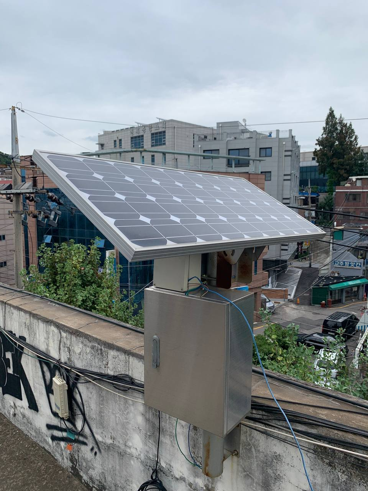

| 태양광 패널 | 내부 시스템 구성 | 전원: 태양광 충전기, 배터리 | 서버: 라즈베리파이, 와이파이 어댑터  |
| :---:         |     :---:      |          :---: | :---: |
|  | .jpeg){width="36px"}      | .jpeg){width="36px"}     | .jpeg){width="36px"}  |

설치 위치: 위도 37.493423, 경도 126.834054
 

# 재료

 - 태양광패널
 - 태양광 배터리 충전기
 - 배터리
 - 5V 전압 레귤레이터
 - 라즈베리파이3
 - 전류센서 (INA226)
  

