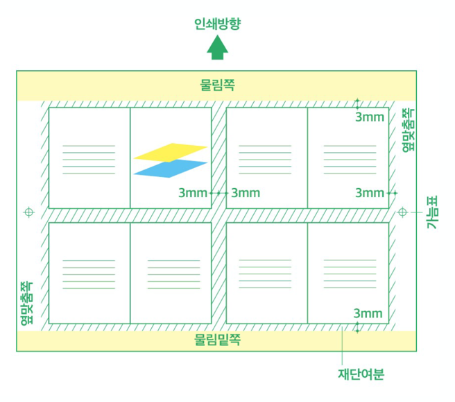

전시를 구성하는 많은 요소 중 전시 홍보에도 많은 예산과 자원을 필요로 한다. 특히 홍보를 위해서는 각종 디자인 작업물이 다양한 재료로 제작 및 배포되는데 이 장에서는 현수막, 시트지, 인쇄물 등의 제작물과 전시 운영에 필요한 요소, 시스템 등을 ‘비거니즘’의 관점으로 나열 및 분석해보고 대안적 재료와 방식을 찾아보려 한다.

## A. 시트지

1. 소재 정의

시트지(점착 시트지)란, 이형지(스티커 뒤에 붙어 있는 점착제 가 붙지 않는 종이)에 점착제를 바른 후, 열닥트를 통과하면서 적당히 건조하여 점착력이 있는 상태로 만들어, 시트지 원지(박리지 )와 합지한 것을 말한다.

2. 주 소재

시트지의 주소재는 폴리염화비닐(polyvinyl chloride, 이하 PVC)이다. 폴리염화비닐(PVC)은 반액체(semi-liquid)의 특성이 있어 쉽게 펴고 늘릴 수 있는 가단성을 가지고 있다. 가단성은 플라스틱, 가소제(plasticizer)의 주요 특징으로 플라스틱, 폴리염화비닐(PVC)이 전 세계에 자리잡게 된 이유도 이러한 PVC의 특징 때문이라고 할 수 있다. 더불어 폴리염화비닐(PVC)은 열에 강하고 절연체의 특성을 가지고 있다. 이렇듯 폴리염화비닐(PVC)은 건축이나 케이블과 같은 기본 자재로 쓰이기도 하고 봉투나 장갑과 같은 일상 생활용품 등으로 넓은 영역에 분포해 있다.

3. 전시에서의 시트지 사용

시트지는 레이저 컷팅으로 세밀한 글자와 그래픽적 표현이 가능하여 전시 캡션과 전시 제목 등의 레터링과 전시 디자인 뿐 아니라 전시 작품의 일부가 되기도 하며 다양한 월 그래픽의 재료로 쓰인다. 

4. 환경오염을 일으키는 요인

 a. 잔류성 유기오염물질(POPs)

잔류성 유기오염물질(Persistent organic pollutants, 이하 POPs)은 “forever chemicals”라고도 불리는데 그 이유는 생분해(biodegradation) 과정이 되지 않고 매우 오랜 시간 남아 있기 때문이다. 우리가 폴리염화비닐(PVC)을 쓰고 버리면 주로 태워서 처리가 된다. 이때 태워도 완전히 분해되지 않고 남아 있는 물질이 바로 미세 플라스틱(microplastic)이다. 미세 플라스틱은 폴리염화비닐(PVC)을 분해할 때 발생하는 POP를 흡수하는 역할을 한다.  

 b. 프탈레이트(Phthalates)
딱딱한 폴리염화비닐(PVC)플라스틱을 부드럽게 만들어주는 가소제다. 이 물질은 ‘내분비계 교란물질’(흔히 환경호르몬으로 알려져 있다)을 발생하며 카드뮴, 납 등의 유해 중금속이 안정제 또는 색소로도 사용된다.

 c. 프탈레이트 기체 물질들
폴리염화비닐(PVC)이 공기나 물에 노출이 되면 DEHP(diethylhexyl phthalate)나 BBzP(butyl benzyl phthalate) 같은 프탈레이트 기체 물질들이 공기 중으로 스며들며 허공을 떠다니거나 먼지에 달라붙게 된다. 숨을 쉬거나 음식을 섭취하는 과정에서 또는 피부와 접촉함으로써 우리는 이런 유해화학물질에 노출된다.

대안적 재료

비염소 비닐

‘비염소 비닐’이라 명명할 수 있는 폴리염화비닐(PVC)의 대체 가능 재료에는 여러 종류가 있다. 그중에는 폴리비닐부티랄(Polyvinyl butyral, PVB), 폴리비닐알코올(Polyvinyl alcohol, PVA), 폴리에틸렌초산비닐(Polyethylene Vinyl Acetate, PEVA), 그리고 에틸렌초산비닐(Ethylene Vinyl Acetate, EVA)이 있다. 이 비염소 비닐의 이름과 기존비닐의 이름에서 가장 큰 차이점은 이름에 C가 없어진 점이다. 비염소 비닐의 이름에서 알 수 있듯이 폴리염화비닐(PVC)의 C가 나타내는 염소(chlorine)이 문제가 된다는 사실을 알 수 있다. 이렇게 비염소비닐은 폴리염화비닐(PVC) 속 염소를 제거하고 다른 원소들로 대체함으로써 같은 성질을 나타내면서도 환경 오염은 줄일 수 있게 변형이 되었다. 최근 환경호르몬을 배출하지 않고 재활용 가능한 PET소재의 비염소 소재의 시트지가 개발되고 있으며 일부 업체 에서 판매 중에 있다. 

실크스크린
실크 스크린은 스텐실과 유사한 판화 기법으로 판의 미세한 구멍으로 잉크를 통과 시켜 일정한 도안 및 글자를 인쇄하는 방법이다. 작업의 특성상 사이즈가 큰 그래픽 요소에는 적당하지 않으나 미세한 표현까지 인쇄가 가능하고 종이가 아닌 벽면이나 천, 좌대, 곡면 인쇄가 가능해 작품의 캡션, 전시장 입구의 전시 설명 등 가로세로 1m를 넘어가지 않는 범위에서 시트지를 대체할 수 있다.
판(나무 및 알루미늄으로 제작되는 판과 폴리에스테르 천으로 구성된)은 (수성)잉크 사용 후 물로 세척하여 판을 재사용 할 수 있다는 장점이 있다. 다만 유성잉크 사용시 용매 및 세척 용도로 고독성의 물질 자일렌 (Xylene, 이하 XY)이 사용되기도 하니 주의가 필요하다. 잉크 세척 과정 등을 생각하면 실크 스크린 또한 완벽히 친환경적 대안이라고는 할 수 없다.

UV 평판 프린트
UV 평판 프린트는 벽지, 합판, 타일, 유리, 아크릴, 알루미늄, 석고보드 등 소재에 제한이 적고 휘발성 유기 화합물이 첨가되지 않은 친환경 방식으로 건축, 인테리어 분야에 폭넓게 사용이 가능한 새로운 방법이다.

레이저 및 CNC 가공
시트커팅 또한 레이저 가공의 한 방법이긴 하나 종이, 목재, 알루미늄 등의 재료에 커팅, 인그레이빙, 마킹 등의 방식을 활용하여 시트지의 사용을 대체할 수 있다.

기타
전시 및 작품 설명 등은 손으로 직접 쓰거나 종이 프린트로 대체할 수 있으며, 최근 QR코드 사용이 대중화되며 정보를 인쇄물이 아니라 온라인에서 확인할 수 있는 방법으로 최근 전시에서도 자주 사용하고 있는 방법 중 하나이다.

## 현수막
현수막(Banner)은 행사, 정당, 시민단체, 학원, 음식점 등의 다양한 분야의 홍보용으로 거는 넓고 튼튼한 긴 직사각형 모양의 천이다.

주 소재
현수막의 천 소재는 '그래픽원단'이라고도 불리는 폴리에스터(Polyester) 원단으로 폴리에스터 섬유원단은 표면 흡수성이 뛰어나 출력시 번지지 않으며 내구성이 강하다. 안료용은 내수성 및 내마모성이 탁월하여 옥외광고용에 적합하며, 염료용은 색상이 선명하여 옥내용 광고물 제작에 적합한 장점이 있다. 

전시에서의 현수막 사용
현수막은 전시의 주최와 규모에 따라 사용 범위가 다양하나 주로 미술관 외벽의 대형 현수막과 가로형 배너, 가로등 배너, 로비 앞이나 매표소 등에 사용된다. 비엔날레와 같이 이벤트 기간이 길고 대규모의 (국제) 전시일수록 사용되는 수량과 게재되는 장소는 급격히 늘어난다. 

환경오염을 일으키는 요인
재사용성
현수막은 일반적으로 특정 이벤트를 위해서만 사용되므로 그 외의 사용이 제한적일 수밖에 없다. 이벤트가 진행되는 기간이 짧을수록 현수막의 반-환경성도 증가한다.

재활용성
일회용에 가까운 현수막은 재활용이 안돼 소각/매립 처리 된다. 현수막을 소각할 경우에는 이산화탄소와 다이옥신 등 유해물질들이 발생하며, 매립할 경우에도 현수막에 사용된 염료로 인한 토양오염을 일으킨다.
현수막의 처리비용은 톤당 30만원(2021년 3월 폐합성수지 처리가격), 기술원에 따르면, 21톤 현수막의 폐기를 위한 처리에는 약 28억이 소요될 것으로 추산된다.

내재에너지
폴리에스터 섬유를 제작하는 과정에서 발생하는 에너지는 아마(Flax)를 사용한 리넨(linen)의 약 12배, 면의 약 2.5배 가량이 높게 나타난다.

대안
제작 최소화 & 미디어보드 활용
현수막은 저렴한 비용으로 다양한 크기의 제작이 가능하기 때문에 가격 대비 효율적인 대체제를 찾기는 쉽지 않다. 또한 생분해 가능한 대안으로 제시되는 소재 폴리락틱애시드(Poly Lactic Acid, 이하 PLA)의 경우 또한 폐기 과정이 여전히 완벽한 대안이라 하기 어렵다. 대부분의 사용 목적이 홍보용임을 감안한다면 꼭 필요한 장소와 수량인지 재고하고 고정된 장소에 설치될 경우 현수막 대신 미디어보드를 사용하여 전시마다 파일을 교체하는 것이 폐기과정에서 발생하는 유해물질과 환경오염을 감소시키는 대안이 될 수 있을 것이다.

업사이클링
폐현수막은 농가에서 보온덮개로 재사용 하기도 하고, 최근에는 사용한 현수막을 업사이클링하는 움직임들이 있어왔다. 폐현수막을 활용해 에코백, 자루, 신발 주머니 등 각종 가방 형태나, 선풍기 싸개, 앞치마 등 방수천 등 생활에서 유용한 물건을 만들기도 하고, 새끼줄 꼬듯 꼬아 밧줄로 제작하기도 한다. 그러나 이러한 업사이클의 경우 폐기 시기를 늦추는 것이지 근본적인 환경 오염을 개선하는 방안은 아니다.

폴리락틱애시드(PLA) 현수막 사용
폴리락틱애시드(PLA)는 옥수수전분이나 사탕수수 등 식물 자원에서 추출한 젖산을 이용해 실을 뽑아 섬유를 만드는 기술로, 이처럼 식물성 수지 필름을 사용해 현수막을 제조하는 업체가 생겼다. 
PLA 현수막은 천연 식물성 소재의 사용으로 자연순환 가능성을 제시하고 인체에 무해한 소재라고 할 수 있다. 또한 소각시 석유화학제품에 비해 이산화탄소 발생량의 감소로 지구온난화 방지와 매립시 빠른 자연분해의 장점을 갖고 있다. 하지만 이런 생분해 플라스틱은 특정 온도와 습도의 퇴비화 조건에서 자연계에 존재하는 미생물에 의해 생분해된다는 특징으로 환경표지 인증을 받아 친환경 제품으로 소개되는 것인데, 현재 대부분 종량제봉투에 버려지고 소각되므로 실상 폐기 후 처리과정이 친환경적이라고 말하기는 어렵다. 또한 재활용 쓰레기도 분리 배출할 경우 재활용 선별 처리에 대한 기준이 분명하지 않아 대책이 필요하다.

천 인쇄
방수 기능을 일부 포기하고 광목 등 천연 패브릭 소재에 인쇄하여 현수막으로 활용하는 방법이 있다. 인쇄 기술의 발전으로 문제로 지적되던 발색 등 인쇄 품질도 큰 차이가 없다. 천연소재라 하더라도 인쇄 과정을 거친 패브릭은 재활용이 완벽하게 될 수는 없겠지만 소각 매립 과정에서 환경에 해를 덜 끼치는 방법이라 할 수 있겠다. 특히 방수 기능이 특별히 필요 없는 실내 설치의 경우 추천할 수 있는 방법이다. 

## 우편발송물
전시에서 우편발송 현황
최근 많은 전시들이 온라인 홍보에 많은 비중을 두고 있는 만큼 기존의 우편발송 비율은 감소한 것이 사실이다. 그러나 여전히 국공립기관이나 규모가 큰 미술관은 초청장, 리플렛, 도록 등을 우편발송하고 있다. 

환경오염을 일으키는 원인
일회용품 사용
우편물을 발송하기 위해 부가적으로 사용되는 것으로 비닐봉투, 종이봉투, 테이프, 스티커 등이 사용되고, 경우에 따라서 진행되는 전시를 위해 따로 인쇄 및 제작을 하기도 한다. 도록의 우편발송을 위해서는 완충재 및 포장재 사용이 추가로 발생한다. 

교통
전 세계 온실가스의 16%가 교통에서 나온다고 한다. 도로 교통에서 발생하는 비율이 96%가 넘는 원인을 차지하고 있고 그 중 승용차가 온실가스에서 차지하는 비율은 48%, 택배를 포함한 각종 화물차가 35%를 차지한다. 초대장 발송에 따른 우편서비스는 배송 과정에서 이산화탄소 배출이 필연적이다. 
우편 서비스는 특성상 에너지 다소비 수송 서비스로 우편물 1개당 이동 거리를 10km로 환산했을 때의 CO2 발생량은 2.4kg, 필요한 소나무는 0.4그루다. 

대안
초청장, 리플렛 등은 우편발송을 지양하고 이메일 또는 MMS 발송 및 모바일 초대장을 활용하는 등 온라인 중심으로 홍보 방안 재편할 필요가 있다. 

## 오프닝 리셉션
코로나19 이후 모임과 행사가 전면 취소되며 오프닝 행사가 거의 없어지다시피 했지만 오프닝 리셉션은 전시의 규모를 떠나 관례적으로 행해지고 있다.

자주 등장하는 메뉴
오프닝 리셉션은 주로 음료와 함께 먹기 간편한 핑거푸드 중심으로 구성되어있다.  자주 등장하는 메뉴로는 물, 주스 2종, 화이트와인, 레드와인, 맥주 등의 음료와 카나페, 콜드 파스타, 치즈 꼬치, 과일 꼬치, 미니 샌드위치, 쿠키, 과일, 주먹밥, 샐러드 등이 있다. 

사용되는 일회용품
오프닝 리셉션의 특성상 컵이나 접시 등도 음식이나 음료를 담을 때마다 용기를 바꿔 사용하는 경향이 있어 1인당 기본적으로 2~3개의 용기를 사용하게 된다. 또한 재사용이 가능한 용기도 음식물이 묻어 있어 무분별하게 버려진다.

- 개별 포장
- 핑거 푸드의 일회용 꼬치
- 종이, 플라스틱, 스티로폼 앞접시
- 스프용 볼
- 종이, 플라스틱 소재 음료 컵
- 플라스틱 소재 와인 컵 
- 냅킨
- 젓가락, 숟가락, 포크

대안
개인용 수저와 텀블러 등의 지참
개인용 수저와 텀블러 등의 지참을 권유하는 안내를 사전에 공지함으로써 오프닝 리셉션에서 소비되는 일회용품 사용을 줄이는 것이 최우선시 되어야 할 것이다. 이와 같은 제스처는 환경을 고민하는 기관의 태도를 보여주는 동시에 개인들의 행동 양식을 변화시키는 효과를 가져다 줄 것이다. 

다회용 식기 사용
식기 세척 등의 인력이 없을 경우, 다회용 식기의 대여-수거-세척 등의 서비스를 제공하는 업체를 이용하는 것도 하나의 대안이다. 이를 통해 ‘함부로 버리지 않는 라이프 스타일’ 을 만드는 데 일조할 수 있다. 

생분해 제품 사용 
낙엽 접시
미국의 베르테라(VerTerra)라는 회사에서 처음 만든 낙엽으로 만든 접시는 일회용종이컵이나 여타의 바이오 플라스틱 제품과는 달리 별도의 화학약품등의 첨가물이 없이 만들어지는 것이 특징이다. 수집한 낙엽을 열에 가한 후 압착하는 과정으로 만들어진다고 한다. 폐기 후 60일이내에 생분해 비료화 되며 화학 첨가물이 없기에 소각되는 경우에도 유해성분이 덜 배출된다. 

감자 전분으로 만든 접시
식품첨가물인 구아검과 감자 전분 등으로 만들어진 이 접시는 사용하고 난 뒤 원반을 던지듯 풀숲에 던져버리면, 새나 다람쥐가 먹을 수 있고 새가 먹지 않더라도 2주 가량 뒤에는 완전히 분해되는 성분으로 제작되었다.

PLA등으로 만든 대안 플라스틱 접시
PLA등 생분해 플라스틱 소재로 만들어진 용기가 많이 출시되고 있다. 현수막 파트에서 언급했듯 PLA등 바이오 플라스틱은 식물성 재료로 만들어져 일반 플라스틱에 비해 친환경적인 것은 맞다. 하지만 대부분 소각되는 재활용 봉투에 넣어 버려지고 생분해 조건에 맞춰 매립되는 폐기 기준이 매번 지켜지는 것이 아니므로 폐기 기준 마련이 시급한 문제가 남아있다. 이는 여타의 대안재료 또한 모두 가지고 있는 문제라 할 수 있다. 또한 대부분의 바이오 플라스틱은 옥수수 또는 그와 유사한 식물로 만들어지기 때문에 대안 플라스틱 사용이 더 확산될 경우 식량 재배를 위한 땅이 ‘플리스틱 재배'에 사용될 수 있다. 이것은 거대한 축산업의 사료를 만들기 위해 아마존 열대우림 등 산림을 파괴하여 그 땅에 옥수수를 재배하며 생긴 문제를 떠올리게 된다.

각갑류 껍질에서 추출한 키틴으로 만든 대안 플라스틱
영국의 스타트업 기업인 셸워크스(https://www.theshellworks.com/)의 바이오 플라스틱 용기가 화제가 되었고 최근 국내 연구진 또한 갑각류의 키틴 및 키토산 성분을 활용하여 땅에서 분해되는 비닐 개발을 성공했단 발표가 있었다. 미세 플라스틱 문제를 고려하면 이러한 다양한 연구를 환영할만 하지만, 동물성 성분이 포함된 제품인지는 체크할 필요가 있다.

과자를 접시로 활용하는 방법
물기가 적은 음식과 디저트 중심의 간단한 케이터링에서는 넓은 모양의 뻥튀기 과자를 활용하여 일회용 접시처럼 이용할 수 있다. 편한 식기는 아니지만 쓰레기를 만들지 않으면서 재밌게 활용할 수 있는 방법이다.

(이미지 출처: 플러스네이처)                                                      
(이미지: 소셜 벤처기업 ㈜리와인드에서 생산한 생분해성 일회용 용기 제품들

*생분해 제품 인증 마크

(이미지 출처: https://slowalk.com/852)

오프닝 리셉션의 간소화
오프닝 리셉션은 손님을 ‘배불리 대접해야 한다’는 한국의 문화적 관습상 마실 것과 먹을 것의 종류와 양도 다양하게, 소위 ‘푸짐하게’ 준비한다. 코로나19 이후 오프닝 행사가 사라지며 그동안 이것들이 관례적으로 행해지고 있었다는 것을 더욱 느낀다. 이 기회로 전시에 필요한 이벤트인지 재고하고 필요할 경우 규모를 간소화하는 다양한 시도를 해볼 수 있을 것이다.

- 2017년 헬싱키에 위치한 갤러리 Lokal에서 열린 전시, Typocraft seoul to helsinki 오프닝 리셉션에서는 전시 제목인 ‘T’ 모양으로 구운 큰 빵이 준비 되어 있었고 원하는 관객들은 먹을만큼 조금씩 잘라 집어 먹었다. ‘먹는’ 행위에 초점을 맞춘 대신 전시를 기념하고 기억하게 만들면서도 쓰레기를 발생시키지 않는 오프닝 리셉션의 좋은 예시라고 할 수 있다.

채식 메뉴 구성
기후 변화의 가장 큰 원인은 온실가스 배출이며 가장 심각한 분야가 축산업이다. 인간 활동으로 배출되는 모든 온실가스 중 축산업으로 인한 배출 비중이 18%로 운송업으로 인한 배출 비중(13.5%)보다 높고 한다. 채식은 기후와 환경 문제를 비롯, 동물권, 건강 등의 이슈와 연결하여 최근 더 자주 다뤄지고 있다. 오프닝 리셉션을 비건 메뉴로 구성하는 것은 이런 문제들을 고민하면서 동시에 관객들의 개인적 취향, 질병 및 장애 유무, 정치적 지향 등을 배려하기 위해 노력한다는 의지를 담을 수 있다. 

각종 인쇄물
전시에서의 인쇄물 발행
홍보용 인쇄물: 포스터, 리플렛, 초대장, 초대용 엽서
전시 운영: 플로어 플랜, 전시 서문, 종이티켓 
도록 인쇄

환경오염을 일으키는 원인
인쇄물은 기본적으로 목재를 원재료 삼는 종이를 주 재료로 삼기 때문에 벌목과 그에 따르는 에너지, 물, CO2 발생을 야기한다. 인쇄물 챕터에서는 지속가능한 삶을 고민하며 <종이 한장 차이>라는 디자인 프로젝트를 진행한 어라우드 랩의 자료를 참고 삼아 소개하고자 한다. 

에너지 소비
포스터 한 장을 만드는데 아래와 같은 나무 및 에너지 소비가 발생한다.   

잉크용제 사용
-기존 오프셋 인쇄 잉크 용제로 휘발성유기화합물(VOC)이 첨가된 광물성기름을 사용하면 대기오염을 일으킨다. 오프셋 인쇄에 사용되는 PS판(presensitized plate)을 현상할 때 사용하는 현상액이 강산성의 약품이기 때문이다. 이 현상액에는 생화학적 산소 요구량(Biochemical Oxygen Demand, BOD), 화학적 산소 요구량(Chemical Oxygen Demand, COD) 수치가 높다. 또한 환경에 영향을 미치는 산업폐기물인 폐수를 발생시킨다.

대안
온라인 전환  
홍보시 인쇄물 최소화
-리플릿, 포스터 등의 인쇄물은 최소화하고 온라인 홍보의 비중을 높인다.

전시장 입장시 출력물 외 선택지 마련

전시장에서 배포되는 플로어플랜, 전시 서문 등의 종이 출력물과 함께 QR코드, 관람 후 돌려 놓을 수 있는 비치용 등 전시 관련 텍스트를 접하는 다양한 선택지를 마련한다. 종이티켓 등 바로 버려지는 인쇄물 대신 온라인 체크인 기능을 활용한다.

제지 회사별 친환경 종이 파악

인쇄시 인쇄 시스템 안에서 종이 효율성이 좋은 방식을 적극적으로 모색하고 재생종이나 비목재 종이와 같이 친환경 종이를 사용하여 자원 사용을 최소화할 수 있다. 아래 각 제지 회사별로 친환경 종이가 제작되며 각 종이별로 고지율 , 환경인증 등을 확인하고 종이를 고르는 것을 추천한다. 

|제지회사 | 제품명 |
----------- | -------
| [두성종이](http://www.doosungpaper.co.kr/About/ProductGroupList.aspx?SearchType=B&SearchCode=1) | 친환경 종이 삼림인증 '그라운드 컬러매트''크로마룩스'외 다수 |
 

종이절약 판형 찾기

종이를 효율적으로 사용할 수 있는 가장 쉬운 방법은 일반적으로 많이 사용되는 규격 판형으로 제작하는 것이다. 주로 전지는 46전지(788 X 1091mm), 국전지(636X939mm) 두 가지 크기로 생산되는데, 종이에 따라 생산되는 전지의 규격이 다를 수 있으므로 종이 선택시 결정한 판형에 적합한 전지규격을 확인할 필요가 있다. 예를 들어 A열 계열의 판형은 국전지, B열 계열은 판형은 4x6전지에 인쇄되어야 종이 낭비를 줄일 수 있다.

콩기름 잉크 사용
-콩기름 잉크 사용시, 대기오염을 일으키는 휘발성 유기화합물(voc)을 줄일 수 있다. 
-리소그라프 인쇄 방식도 콩기름 잉크를 사용하며 소량인쇄가 가능하다.

종이 재활용 가능한 방식의 후가공 기법 사용
-라미네이팅 대신 UV코팅, CR코팅 등 액체를 분사(화학처리)하는 코팅방식을 사용하면 재활용이 가능하다.

에코폰트의 사용
에코폰트란 글자 안에 작은 구멍이 생기게 해 인쇄시 잉크가 번지는 원리를 이용하여 잉크가 글자의 작은 구멍을 메우도록 한 것이다. 특히 작은 본문용 글씨에 효과적이며 가독성을 유지하는 동시에 최소한의 잉크만을 소모하는 효과가 있다. 

.jpg)

무습수 인쇄
무습수 인쇄는 실리콘 고무층으로 처리되어 있고, 이것이 ‘습수판’의 축임물의 역할을 해 물을 사용하지 않고도 인쇄가 가능하다. 이러한 특징으로 화학물질의 혼합체인 습수액과 휘발성 유기화합물인 IPA가 포함된 축임물을 전혀 사용하지 않기 때문에 환경친화적이며 인체에 미치는 영향이 적다. 또, 망점이 선명해 품질이 낮은 재생지나 신문용지에서도 고품질 인쇄를 구현할 수 있을 뿐만 아니라 종이 이외에 플라스틱, 포일, 금속, 합판 등 흡수성이 떨어지는 원단에도 쉽게 인쇄를 할 수 있어 활용 범위가 넓다.

